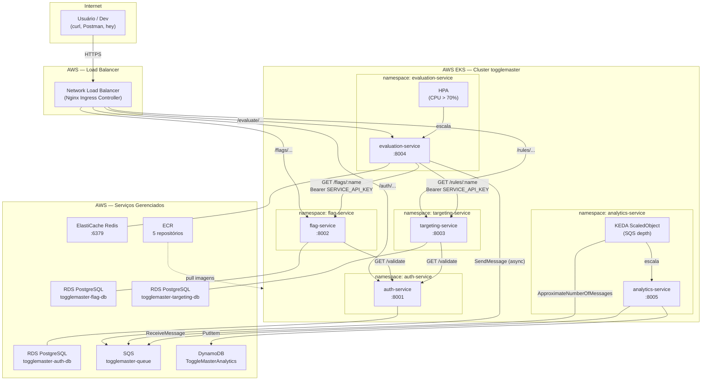
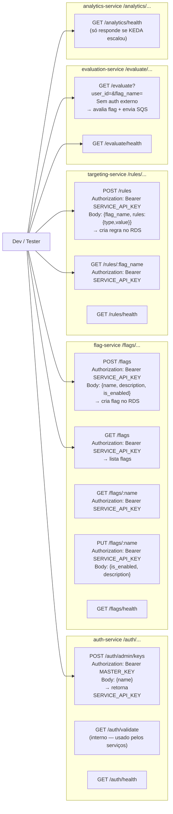

# Fase C — Deploy EKS Cloud (AWS real)

Implantação dos 5 microserviços no EKS com serviços AWS reais.
Todos os manifestos ficam em `manifests-eks/` — **não altere `manifests/` (local)**.

---

## Arquitetura Cloud



---

## Serviços, Relações e o que será Validado

### auth-service (:8001)
Serviço de autenticação e gestão de credenciais. Armazena usuários e chaves de API no banco `auth-db` (RDS). Expõe `GET /auth/validate` — rota interna chamada por **flag-service** e **targeting-service** para autenticar qualquer requisição que carregue um `Bearer <SERVICE_API_KEY>`. A chave não é trafegada em plaintext no banco: o auth-service grava o SHA256 do token e compara o hash na validação.

**Validação:** health check (`/health`) → bootstrap da `SERVICE_API_KEY` via `POST /auth/bootstrap` → verificar que a chave retornada é usada com sucesso em chamadas às rotas dos outros serviços.

---

### flag-service (:8002)
CRUD das feature flags. Armazena definições de flags no banco `flag-db` (RDS). Toda rota (exceto `/health`) exige `Bearer SERVICE_API_KEY` — ele valida chamando `GET /auth/validate` no auth-service. O evaluation-service consulta `GET /flags/:name` em caso de **cache MISS** no Redis.

**Validação:** `POST /flags` para criar a flag `enable-new-dashboard` → `GET /flags` para confirmar → logs do pod para ver a chamada de validação ao auth-service.

---

### targeting-service (:8003)
CRUD das regras de segmentação (targeting). Armazena regras por flag no banco `targeting-db` (RDS). Mesma autenticação que o flag-service: valida cada request em `GET /auth/validate`. O evaluation-service consulta `GET /rules/:flag_name` em caso de **cache MISS**. A regra `PERCENTAGE` determina se um `user_id` é incluído via SHA1(`userID + flagName`) % 100.

**Validação:** `POST /rules` com `{"type":"PERCENTAGE","value":100}` para a flag criada → `GET /rules` para confirmar.

---

### evaluation-service (:8004) — hot path
O único endpoint **sem autenticação** exposto para tráfego de cliente final (`GET /evaluate?user_id=...&flag_name=...`). Otimizado para baixa latência via cache Redis. Fluxo por requisição:

1. Consulta Redis com chave `flag_info:<flagName>`. Se existir → **Cache HIT**, retorna direto.
2. Se não existir → **Cache MISS**: busca flag-service + targeting-service em paralelo → salva no Redis com TTL de 30 s.
3. Avalia a regra (ex: PERCENTAGE via SHA1) → retorna `true`/`false`.
4. Envia evento assíncrono para SQS: `{"user_id":"...","flag_name":"...","result":...,"timestamp":"..."}`.

O HPA escala os pods com base em CPU > 70 %. Usa `SERVICE_API_KEY` internamente para chamar flag-service e targeting-service via DNS interno do cluster (não passa pelo LB).

> **Por que os outros endpoints também ficam públicos no LB?** `/flags/*` e `/rules/*` exigem `Bearer SERVICE_API_KEY` no código — já estão protegidos pela aplicação. Eles ficam acessíveis via LB porque você precisa chamá-los por curl durante o setup (criar flags e regras) e o avaliador precisa testá-los pelo Postman. "É o único endpoint que clientes finais devem chamar" é uma orientação arquitetural — não há restrição de rede a configurar.

**Validação:** dois curls consecutivos (1º → log `Cache MISS`, 2º → log `Cache HIT`) monitorando `kubectl logs -f`; carga com `hey` para disparar o HPA; confirmar mensagens na fila SQS.

---

### analytics-service (:8005) — worker
Worker puro, sem API pública (apenas `/health`). Consome mensagens da fila SQS em loop, faz parse do evento e grava um item em DynamoDB (`PutItem` na tabela `ToggleMasterAnalytics`). KEDA monitora `ApproximateNumberOfMessages` da fila e escala os pods de 0 a 5 conforme profundidade (`queueLength: "5"`).

**Validação:** enviar múltiplas avaliações → observar KEDA escalar os pods (`kubectl get pods -n analytics-service -w`) + logs do pod mostrando processamento → `aws dynamodb scan` para confirmar itens gravados.

---

## ALERTA DE CUSTO

| Recurso                       | Custo/hora   | Custo/dia   |
| ----------------------------- | ------------ | ----------- |
| EKS control plane             | $0.10        | $2.40       |
| EC2 t3.medium × 2 nodes       | $0.094       | $2.26       |
| NAT Gateway                   | $0.045       | $1.08       |
| RDS db.t3.micro × 3           | $0.048       | $1.15       |
| ElastiCache cache.t3.micro    | $0.017       | $0.41       |
| Load Balancer (Nginx Ingress) | $0.025       | $0.60       |
| **TOTAL**                     | **~$0.36/h** | **~$8/dia** |

**Subir → gravar vídeo → destruir no mesmo dia. Ver seção TEARDOWN.**

---

## Pré-requisitos

### Ferramentas

| Ferramenta | Status                |
| ---------- | --------------------- |
| eksctl     | instalar (ver abaixo) |
| helm       | ✅ instalado           |
| aws CLI    | ✅ instalado           |
| kubectl    | ✅ instalado           |
| hey        | ✅ instalado           |

### Instalar eksctl

```bash
curl -sL "https://github.com/eksctl-io/eksctl/releases/latest/download/eksctl_Linux_amd64.tar.gz" | tar xz -C /tmp
```

```bash
sudo mv /tmp/eksctl /usr/local/bin/
```

```bash
eksctl version
```

### Autenticar AWS CLI (conta administrativa — não root)

```bash
aws configure
```

Preenche: Access Key ID, Secret Access Key, região `us-east-1`, output `json`.

```bash
aws sts get-caller-identity
```

Saída: seu `Account` (anote — é o `<ACCOUNT_ID>` usado em todos os comandos), `UserId`, `Arn`.

---

## Variável de sessão

Defina uma vez e use em todos os comandos abaixo:

```bash
ACCOUNT_ID=$(aws sts get-caller-identity --query Account --output text)
```

```bash
echo $ACCOUNT_ID
```

---

## ETAPA 1 — Recursos independentes de VPC (SQS, DynamoDB, ECR)

Criar antes do cluster — não dependem de VPC.

### 1.1 — SQS

```bash
aws sqs create-queue --queue-name togglemaster-queue --region us-east-1
```

Anote a URL retornada (ex: `https://sqs.us-east-1.amazonaws.com/123456789/togglemaster-queue`).

### 1.2 — DynamoDB

```bash
aws dynamodb create-table \
  --table-name ToggleMasterAnalytics \
  --attribute-definitions AttributeName=event_id,AttributeType=S \
  --key-schema AttributeName=event_id,KeyType=HASH \
  --billing-mode PAY_PER_REQUEST \
  --region us-east-1
```

### 1.3 — ECR: 5 repositórios

```bash
aws ecr create-repository --repository-name togglemaster/auth-service --region us-east-1
```

```bash
aws ecr create-repository --repository-name togglemaster/flag-service --region us-east-1
```

```bash
aws ecr create-repository --repository-name togglemaster/targeting-service --region us-east-1
```

```bash
aws ecr create-repository --repository-name togglemaster/evaluation-service --region us-east-1
```

```bash
aws ecr create-repository --repository-name togglemaster/analytics-service --region us-east-1
```

**Preencher:**

- [ ] SQS criada — URL anotada
- [ ] DynamoDB `ToggleMasterAnalytics` criada
- [ ] ECR: 5 repos criados

---

## ETAPA 2 — Criar cluster EKS

Demora ~15-20 min. Cria: cluster EKS, VPC, subnets públicas/privadas, NAT Gateway, node group t3.medium × 2, OIDC provider (necessário para IRSA).

```bash
eksctl create cluster \
  --name togglemaster \
  --region us-east-1 \
  --nodegroup-name standard-workers \
  --node-type t3.medium \
  --nodes 2 \
  --nodes-min 1 \
  --nodes-max 4 \
  --with-oidc \
  --managed
```

Aguarde o prompt retornar. Acompanhe no AWS Console → CloudFormation se quiser.

O `eksctl` já configura o kubectl automaticamente. Confirmar que o contexto ativo é o EKS (não o minikube):

```bash
aws eks update-kubeconfig --name togglemaster --region us-east-1
```

```bash
kubectl config current-context
```

Esperado: `arn:aws:eks:us-east-1:<ACCOUNT_ID>:cluster/togglemaster`

```bash
kubectl get nodes
```

Esperado: 2 nodes `Ready` (EC2, não minikube).

> Para alternar contextos depois:
> 
> - Voltar pro minikube: `kubectl config use-context minikube`
> - Voltar pro EKS: `kubectl config use-context arn:aws:eks:us-east-1:<ACCOUNT_ID>:cluster/togglemaster`

### 2.1 — Capturar VPC e subnets (necessário para RDS e ElastiCache)

```bash
aws eks describe-cluster \
  --name togglemaster \
  --region us-east-1 \
  --query 'cluster.resourcesVpcConfig.vpcId' \
  --output text
```

Anote o VPC ID (ex: `vpc-0abc1234`).

```bash
aws ec2 describe-subnets \
  --filters "Name=vpc-id,Values=<VPC_ID>" \
  --query 'Subnets[*].[SubnetId,AvailabilityZone,Tags[?Key==`Name`].Value|[0]]' \
  --output table \
  --region us-east-1
```

Anote pelo menos **2 subnet IDs privadas** (diferentes AZs) — usadas para RDS e ElastiCache.

### 2.2 — Capturar security group dos nodes

```bash
aws eks describe-cluster \
  --name togglemaster \
  --region us-east-1 \
  --query 'cluster.resourcesVpcConfig.clusterSecurityGroupId' \
  --output text
```

Anote o SG ID (ex: `sg-0abc1234`). Os nodes EKS usam este SG — RDS/ElastiCache precisam permitir tráfego dele.

**Preencher:**

- [ ] Cluster criado, 2 nodes Ready
- [ ] VPC ID anotado
- [ ] 2 subnet IDs privadas anotadas
- [ ] Node security group ID anotado

---

## ETAPA 3 — RDS e ElastiCache (na VPC do EKS)

### 3.1 — DB Subnet Group para RDS

```bash
aws rds create-db-subnet-group \
  --db-subnet-group-name togglemaster-db-subnet-group \
  --db-subnet-group-description "ToggleMaster RDS subnets" \
  --subnet-ids <SUBNET_ID_1> <SUBNET_ID_2> \
  --region us-east-1
```

### 3.2 — Security Group para RDS (allow 5432 dos nodes EKS)

```bash
aws ec2 create-security-group \
  --group-name togglemaster-rds-sg \
  --description "RDS PostgreSQL access from EKS nodes" \
  --vpc-id <VPC_ID> \
  --region us-east-1
```

Anote o SG ID retornado (ex: `sg-0rds1234`).

```bash
aws ec2 authorize-security-group-ingress \
  --group-id <RDS_SG_ID> \
  --protocol tcp \
  --port 5432 \
  --source-group <NODE_SG_ID> \
  --region us-east-1
```

### 3.3 — RDS auth-db

```bash
aws rds create-db-instance \
  --db-instance-identifier togglemaster-auth-db \
  --db-instance-class db.t3.micro \
  --engine postgres \
  --engine-version 15 \
  --master-username postgres \
  --master-user-password <ESCOLHA_SENHA_FORTE> \
  --allocated-storage 20 \
  --db-subnet-group-name togglemaster-db-subnet-group \
  --vpc-security-group-ids <RDS_SG_ID> \
  --no-publicly-accessible \
  --region us-east-1
```

### 3.4 — RDS flag-db

```bash
aws rds create-db-instance \
  --db-instance-identifier togglemaster-flag-db \
  --db-instance-class db.t3.micro \
  --engine postgres \
  --engine-version 15 \
  --master-username postgres \
  --master-user-password <ESCOLHA_SENHA_FORTE> \
  --allocated-storage 20 \
  --db-subnet-group-name togglemaster-db-subnet-group \
  --vpc-security-group-ids <RDS_SG_ID> \
  --no-publicly-accessible \
  --region us-east-1
```

### 3.5 — RDS targeting-db

```bash
aws rds create-db-instance \
  --db-instance-identifier togglemaster-targeting-db \
  --db-instance-class db.t3.micro \
  --engine postgres \
  --engine-version 15 \
  --master-username postgres \
  --master-user-password <ESCOLHA_SENHA_FORTE> \
  --allocated-storage 20 \
  --db-subnet-group-name togglemaster-db-subnet-group \
  --vpc-security-group-ids <RDS_SG_ID> \
  --no-publicly-accessible \
  --region us-east-1
```

> RDS demora ~5-10 min cada para ficar `available`. Continue com ElastiCache enquanto espera.

### 3.6 — Cache Subnet Group para ElastiCache

```bash
aws elasticache create-cache-subnet-group \
  --cache-subnet-group-name togglemaster-cache-subnet-group \
  --cache-subnet-group-description "ToggleMaster ElastiCache subnets" \
  --subnet-ids <SUBNET_ID_1> <SUBNET_ID_2> \
  --region us-east-1
```

### 3.7 — Security Group para ElastiCache (allow 6379 dos nodes EKS)

```bash
aws ec2 create-security-group \
  --group-name togglemaster-cache-sg \
  --description "ElastiCache Redis access from EKS nodes" \
  --vpc-id <VPC_ID> \
  --region us-east-1
```

Anote o SG ID retornado (ex: `sg-0cache1234`).

```bash
aws ec2 authorize-security-group-ingress \
  --group-id <CACHE_SG_ID> \
  --protocol tcp \
  --port 6379 \
  --source-group <NODE_SG_ID> \
  --region us-east-1
```

### 3.8 — ElastiCache (Redis)

```bash
aws elasticache create-replication-group \
  --replication-group-id togglemaster-redis \
  --replication-group-description "ToggleMaster Redis" \
  --cache-node-type cache.t3.micro \
  --engine redis \
  --engine-version 7.0 \
  --num-cache-clusters 1 \
  --cache-subnet-group-name togglemaster-cache-subnet-group \
  --security-group-ids <CACHE_SG_ID> \
  --region us-east-1
```

### 3.9 — Aguardar e coletar endpoints

```bash
aws rds describe-db-instances \
  --query 'DBInstances[?contains(`["togglemaster-auth-db","togglemaster-flag-db","togglemaster-targeting-db"]`, DBInstanceIdentifier)].[DBInstanceIdentifier,Endpoint.Address,DBInstanceStatus]' \
  --output table \
  --region us-east-1
```

Quando `DBInstanceStatus = available`, anote os endpoints.

```bash
aws elasticache describe-replication-groups \
  --replication-group-id togglemaster-redis \
  --query 'ReplicationGroups[0].NodeGroups[0].PrimaryEndpoint.Address' \
  --output text \
  --region us-east-1
```

Anote o endpoint do Redis.

**Preencher:**

- [ ] RDS auth-db endpoint: `___________`
- [ ] RDS flag-db endpoint: `___________`
- [ ] RDS targeting-db endpoint: `___________`
- [ ] ElastiCache endpoint: `___________`

---

## ETAPA 4 — Build e push das imagens para ECR real

### 4.1 — Login ECR

```bash
aws ecr get-login-password --region us-east-1 | docker login --username AWS --password-stdin $ACCOUNT_ID.dkr.ecr.us-east-1.amazonaws.com
```

### 4.2 — Build e push (um por serviço)

Defina o registry:

```bash
REGISTRY=$ACCOUNT_ID.dkr.ecr.us-east-1.amazonaws.com
```

**auth-service:**

```bash
docker build -t $REGISTRY/togglemaster/auth-service:latest ./auth-service
```

```bash
docker push $REGISTRY/togglemaster/auth-service:latest
```

```bash
aws ecr describe-images --repository-name togglemaster/auth-service --region us-east-1 --query 'imageDetails[0].[imagePushedAt,imageSizeInBytes]' --output table
```

**flag-service:**

```bash
docker build -t $REGISTRY/togglemaster/flag-service:latest ./flag-service
```

```bash
docker push $REGISTRY/togglemaster/flag-service:latest
```

```bash
aws ecr describe-images --repository-name togglemaster/flag-service --region us-east-1 --query 'imageDetails[0].[imagePushedAt,imageSizeInBytes]' --output table
```

**targeting-service:**

```bash
docker build -t $REGISTRY/togglemaster/targeting-service:latest ./targeting-service
```

```bash
docker push $REGISTRY/togglemaster/targeting-service:latest
```

```bash
aws ecr describe-images --repository-name togglemaster/targeting-service --region us-east-1 --query 'imageDetails[0].[imagePushedAt,imageSizeInBytes]' --output table
```

**evaluation-service:**

```bash
docker build -t $REGISTRY/togglemaster/evaluation-service:latest ./evaluation-service
```

```bash
docker push $REGISTRY/togglemaster/evaluation-service:latest
```

```bash
aws ecr describe-images --repository-name togglemaster/evaluation-service --region us-east-1 --query 'imageDetails[0].[imagePushedAt,imageSizeInBytes]' --output table
```

**analytics-service:**

```bash
docker build -t $REGISTRY/togglemaster/analytics-service:latest ./analytics-service
```

```bash
docker push $REGISTRY/togglemaster/analytics-service:latest
```

```bash
aws ecr describe-images --repository-name togglemaster/analytics-service --region us-east-1 --query 'imageDetails[0].[imagePushedAt,imageSizeInBytes]' --output table
```

Saída esperada por serviço: timestamp recente + tamanho em bytes. Confirma que o push chegou no ECR.

**Preencher:**

- [ ] 5 imagens pushed — timestamp e tamanho confirmados no ECR

---

## ETAPA 5 — IRSA: roles IAM para os pods

IRSA = IAM Roles for Service Accounts. Permite que pods individuais tenham credenciais AWS sem expor chaves nos Secrets.

### 5.1 — Policy para analytics-service (SQS consumer + DynamoDB writer)

```bash
cat > /tmp/analytics-policy.json << EOF
{
  "Version": "2012-10-17",
  "Statement": [
    {
      "Effect": "Allow",
      "Action": ["sqs:ReceiveMessage","sqs:DeleteMessage","sqs:GetQueueAttributes"],
      "Resource": "arn:aws:sqs:us-east-1:$ACCOUNT_ID:togglemaster-queue"
    },
    {
      "Effect": "Allow",
      "Action": ["dynamodb:PutItem"],
      "Resource": "arn:aws:dynamodb:us-east-1:$ACCOUNT_ID:table/ToggleMasterAnalytics"
    }
  ]
}
EOF
```

```bash
aws iam create-policy \
  --policy-name togglemaster-analytics-policy \
  --policy-document file:///tmp/analytics-policy.json \
  --region us-east-1
```

Anote o Policy ARN retornado.

### 5.2 — Policy para evaluation-service (SQS publisher)

```bash
cat > /tmp/evaluation-policy.json << EOF
{
  "Version": "2012-10-17",
  "Statement": [
    {
      "Effect": "Allow",
      "Action": ["sqs:SendMessage","sqs:GetQueueAttributes"],
      "Resource": "arn:aws:sqs:us-east-1:$ACCOUNT_ID:togglemaster-queue"
    }
  ]
}
EOF
```

```bash
aws iam create-policy \
  --policy-name togglemaster-evaluation-policy \
  --policy-document file:///tmp/evaluation-policy.json \
  --region us-east-1
```

### 5.3 — IRSA role para analytics-service

```bash
eksctl create iamserviceaccount \
  --name analytics-service-sa \
  --namespace analytics-service \
  --cluster togglemaster \
  --attach-policy-arn arn:aws:iam::$ACCOUNT_ID:policy/togglemaster-analytics-policy \
  --approve \
  --region us-east-1
```

### 5.4 — IRSA role para evaluation-service

```bash
eksctl create iamserviceaccount \
  --name evaluation-service-sa \
  --namespace evaluation-service \
  --cluster togglemaster \
  --attach-policy-arn arn:aws:iam::$ACCOUNT_ID:policy/togglemaster-evaluation-policy \
  --approve \
  --region us-east-1
```

> `eksctl create iamserviceaccount` cria o ServiceAccount no cluster E a IAM Role com trust policy para o OIDC do cluster. Não é necessário aplicar `serviceaccount.yaml` separadamente.

**Preencher:**

- [ ] Policy analytics criada
- [ ] Policy evaluation criada
- [ ] IRSA analytics-service-sa criado
- [ ] IRSA evaluation-service-sa criado

---

## ETAPA 6 — Instalar componentes no cluster

### 6.1 — Metrics Server

```bash
kubectl apply -f https://github.com/kubernetes-sigs/metrics-server/releases/latest/download/components.yaml
```

```bash
kubectl get deployment metrics-server -n kube-system -w
```

Esperado: `1/1` Ready.

### 6.2 — KEDA

> **Opção B escolhida (conta pessoal):** O PDF exige HPA por CPU para o analytics-service como requisito mínimo (Opção A). Para conta pessoal com acesso total ao IAM, o PDF recomenda KEDA — que monitora diretamente `ApproximateNumberOfMessages` da fila SQS, escala de 0→N e é mais preciso que CPU como trigger. HPA para evaluation-service (CPU > 70%) é mantido normalmente.

```bash
helm repo add kedacore https://kedacore.github.io/charts
```

```bash
helm repo update
```

```bash
helm install keda kedacore/keda --namespace keda --create-namespace
```

```bash
kubectl get pods -n keda
```

Esperado: `keda-operator-*` e `keda-operator-metrics-apiserver-*` Running.

### 6.3 — Nginx Ingress Controller

```bash
helm repo add ingress-nginx https://kubernetes.github.io/ingress-nginx
```

```bash
helm repo update
```

```bash
helm install ingress-nginx ingress-nginx/ingress-nginx \
  --namespace ingress-nginx \
  --create-namespace
```

```bash
kubectl get svc -n ingress-nginx
```

Aguarde até `EXTERNAL-IP` aparecer (DNS do Load Balancer AWS, ex: `abc123.us-east-1.elb.amazonaws.com`). Pode levar 2-3 min.

```bash
kubectl get svc ingress-nginx-controller -n ingress-nginx \
  --output jsonpath='{.status.loadBalancer.ingress[0].hostname}'
```

Anote o DNS do Load Balancer — é a URL pública de acesso a todos os serviços.

**Preencher:**

- [ ] Metrics Server: Running
- [ ] KEDA: pods Running
- [ ] Nginx Ingress: Running
- [ ] Load Balancer DNS anotado: `___________`

---

## ETAPA 7 — Preencher placeholders nos manifests-eks/

Abra cada arquivo listado abaixo e substitua os placeholders. Todos os arquivos têm comentário `# SUBSTITUIR` marcando exatamente onde editar.

Seu Account ID:

```bash
aws sts get-caller-identity --query Account --output text
```

### 7.1 — `<ACCOUNT_ID>` — edite os 8 arquivos abaixo

Abra cada um e substitua `<ACCOUNT_ID>` pelo seu Account ID de 12 dígitos:

- `manifests-eks/auth-service/deployment.yaml` → campo `image:`
- `manifests-eks/flag-service/deployment.yaml` → campo `image:`
- `manifests-eks/targeting-service/deployment.yaml` → campo `image:`
- `manifests-eks/evaluation-service/deployment.yaml` → campo `image:`
- `manifests-eks/evaluation-service/configmap.yaml` → campo `AWS_SQS_URL`
- `manifests-eks/analytics-service/deployment.yaml` → campo `image:`
- `manifests-eks/analytics-service/configmap.yaml` → campo `AWS_SQS_URL`
- `manifests-eks/analytics-service/scaledobject.yaml` → campo `queueURL`

> `serviceaccount.yaml` de analytics e evaluation: não aplicar via kubectl. O eksctl cria esses ServiceAccounts. Os comentários no arquivo explicam isso.

### 7.2 — Preencher DATABASE_URL dos 3 serviços com RDS

Para cada serviço, gere o base64 e edite o secret:

**auth-service:**

```bash
echo -n "postgresql://postgres:<SENHA>@<RDS-AUTH-ENDPOINT>:5432/postgres" | base64
```

Cole o resultado em `manifests-eks/auth-service/secret.yaml` no campo `DATABASE_URL`.

**flag-service:**

```bash
echo -n "postgresql://postgres:<SENHA>@<RDS-FLAG-ENDPOINT>:5432/postgres" | base64
```

Cole em `manifests-eks/flag-service/secret.yaml`.

**targeting-service:**

```bash
echo -n "postgresql://postgres:<SENHA>@<RDS-TARGETING-ENDPOINT>:5432/postgres" | base64
```

Cole em `manifests-eks/targeting-service/secret.yaml`.

### 7.3 — Gerar e preencher MASTER_KEY do auth-service

```bash
openssl rand -hex 32
```

Anote o valor gerado (ex: `a3f1...`). Converta para base64:

```bash
echo -n "<VALOR_GERADO>" | base64
```

Cole em `manifests-eks/auth-service/secret.yaml` no campo `MASTER_KEY`.

### 7.4 — Preencher REDIS_URL no evaluation configmap

Edite `manifests-eks/evaluation-service/configmap.yaml`:

```yaml
REDIS_URL: "redis://<ELASTICACHE-ENDPOINT>:6379"
```

Substitua `<ELASTICACHE-ENDPOINT>` pelo endpoint anotado na ETAPA 3.

**Preencher:**

- [ ] `<ACCOUNT_ID>` substituído em todos os YAMLs
- [ ] DATABASE_URL auth-service preenchido
- [ ] DATABASE_URL flag-service preenchido
- [ ] DATABASE_URL targeting-service preenchido
- [ ] MASTER_KEY preenchido
- [ ] REDIS_URL preenchido

---

## ETAPA 8 — Deploy dos serviços (ordem obrigatória)

Aplique arquivo por arquivo — não use `kubectl apply -f .` (namespace race condition).

### 8.1 — auth-service

```bash
kubectl apply -f manifests-eks/auth-service/namespace.yaml
```

```bash
kubectl apply -f manifests-eks/auth-service/secret.yaml
```

```bash
kubectl apply -f manifests-eks/auth-service/configmap.yaml
```

```bash
kubectl apply -f manifests-eks/auth-service/deployment.yaml
```

```bash
kubectl apply -f manifests-eks/auth-service/service.yaml
```

```bash
kubectl apply -f manifests-eks/auth-service/ingress.yaml
```

```bash
kubectl get pods -n auth-service
```

Aguardar `Running 1/1`.

### 8.2 — flag-service

```bash
kubectl apply -f manifests-eks/flag-service/namespace.yaml
```

```bash
kubectl apply -f manifests-eks/flag-service/secret.yaml
```

```bash
kubectl apply -f manifests-eks/flag-service/configmap.yaml
```

```bash
kubectl apply -f manifests-eks/flag-service/deployment.yaml
```

```bash
kubectl apply -f manifests-eks/flag-service/service.yaml
```

```bash
kubectl apply -f manifests-eks/flag-service/ingress.yaml
```

```bash
kubectl get pods -n flag-service
```

### 8.3 — targeting-service

```bash
kubectl apply -f manifests-eks/targeting-service/namespace.yaml
```

```bash
kubectl apply -f manifests-eks/targeting-service/secret.yaml
```

```bash
kubectl apply -f manifests-eks/targeting-service/configmap.yaml
```

```bash
kubectl apply -f manifests-eks/targeting-service/deployment.yaml
```

```bash
kubectl apply -f manifests-eks/targeting-service/service.yaml
```

```bash
kubectl apply -f manifests-eks/targeting-service/ingress.yaml
```

```bash
kubectl get pods -n targeting-service
```

### 8.4 — Bootstrap SERVICE_API_KEY (evaluation depende disso)

Com auth-service Running, crie a API key e extraia o valor diretamente:

```bash
curl -s -X POST http://<LB-DNS>/auth/admin/keys \
  -H "Authorization: Bearer <MASTER_KEY>" \
  -H "Content-Type: application/json" \
  -d '{"name":"evaluation-service"}' | jq -r '.key'
```

A API retorna a key em **plaintext** (ex: `tm_abc123...`). Anote esse valor.

> **Como a key circula no sistema:**
> 
> | Onde                                  | Formato     | Por quê                                                      |
> | ------------------------------------- | ----------- | ------------------------------------------------------------ |
> | Retorno da API                        | plaintext   | é o valor real gerado                                        |
> | `curl -H "Authorization: Bearer ..."` | plaintext   | HTTP não usa base64 aqui                                     |
> | `secret.yaml` campo `stringData:`     | plaintext   | `stringData` aceita texto direto — K8s converte internamente |
> | Dentro do pod (env var)               | plaintext   | K8s injeta já decodificado                                   |
> | Banco do auth-service                 | hash SHA256 | nunca armazena a key em si                                   |
> 
> O banco **nunca viu** a key em plaintext — auth-service só guarda o hash. Na validação, recebe o Bearer token, faz hash e compara. Por isso a key só aparece uma vez (neste curl) e não pode ser recuperada depois.

Cole o valor plaintext retornado em `manifests-eks/evaluation-service/secret.yaml` no campo `SERVICE_API_KEY` (o arquivo já está com `stringData` — só substitua o placeholder `PREENCHER_APOS_BOOTSTRAP`).

> **Diferença do ambiente local:** o `manifestos-k8s.md` usa `data:` (base64 obrigatório via `echo -n "..." | base64`). Aqui o EKS usa `stringData:` — o valor é colado diretamente, sem converter.

Esta mesma key é usada:

- Internamente pelo evaluation-service para chamar flag-service e targeting-service
- Por você nos curls da ETAPA 9 (`Authorization: Bearer <KEY_RETORNADA>`) para criar flags e regras

### 8.5 — evaluation-service

> `serviceaccount.yaml` **não é aplicado aqui** — o `eksctl create iamserviceaccount` da ETAPA 5 já criou o ServiceAccount `evaluation-service-sa` no cluster com a anotação IRSA.

```bash
kubectl apply -f manifests-eks/evaluation-service/namespace.yaml
```

```bash
kubectl apply -f manifests-eks/evaluation-service/secret.yaml
```

```bash
kubectl apply -f manifests-eks/evaluation-service/configmap.yaml
```

```bash
kubectl apply -f manifests-eks/evaluation-service/deployment.yaml
```

```bash
kubectl apply -f manifests-eks/evaluation-service/service.yaml
```

```bash
kubectl apply -f manifests-eks/evaluation-service/ingress.yaml
```

```bash
kubectl apply -f manifests-eks/evaluation-service/hpa.yaml
```

```bash
kubectl get pods -n evaluation-service
```

### 8.6 — analytics-service + KEDA

> `serviceaccount.yaml` **não é aplicado aqui** — o `eksctl create iamserviceaccount` da ETAPA 5 já criou o ServiceAccount `analytics-service-sa` no cluster com a anotação IRSA.

```bash
kubectl apply -f manifests-eks/analytics-service/namespace.yaml
```

```bash
kubectl apply -f manifests-eks/analytics-service/secret.yaml
```

```bash
kubectl apply -f manifests-eks/analytics-service/configmap.yaml
```

```bash
kubectl apply -f manifests-eks/analytics-service/deployment.yaml
```

```bash
kubectl apply -f manifests-eks/analytics-service/service.yaml
```

```bash
kubectl apply -f manifests-eks/analytics-service/ingress.yaml
```

```bash
kubectl apply -f manifests-eks/analytics-service/trigger-auth.yaml
```

```bash
kubectl apply -f manifests-eks/analytics-service/scaledobject.yaml
```

```bash
kubectl get scaledobject analytics-service-scaler -n analytics-service
```

Esperado: `READY=True`. (0 pods é correto — KEDA gerencia.)

---

## ETAPA 9 — Validação

### Mapa de endpoints públicos



| Endpoint                            | Auth                     | Quando usar                                     |
| ----------------------------------- | ------------------------ | ----------------------------------------------- |
| `POST /auth/admin/keys`             | `Bearer MASTER_KEY`      | Bootstrap — gera SERVICE_API_KEY                |
| `POST /flags`                       | `Bearer SERVICE_API_KEY` | Criar flag antes dos testes                     |
| `GET /flags`                        | `Bearer SERVICE_API_KEY` | Confirmar flag no banco                         |
| `POST /rules`                       | `Bearer SERVICE_API_KEY` | Criar regra de segmentação                      |
| `GET /rules/:name`                  | `Bearer SERVICE_API_KEY` | Confirmar regra no banco                        |
| `GET /evaluate?user_id=&flag_name=` | nenhuma                  | Avaliar flag — gera SQS message                 |
| `aws dynamodb scan`                 | AWS CLI                  | Confirmar itens no DynamoDB (sem endpoint HTTP) |

---

### 9.1 — Todos os pods Running

```bash
kubectl get pods -A
```

### 9.2 — Ingress com endereço

```bash
kubectl get ingress -A
```

ADDRESS deve ser o DNS do Load Balancer. Se ainda estiver em branco, aguarde 2-3 min e repita.

> DNS do Load Balancer pode levar até 5 min para propagar. Se os curls retornarem `Could not resolve host`, aguarde e tente novamente.

### 9.3 — Health checks via Load Balancer

```bash
curl -s http://<LB-DNS>/auth/health
```

```bash
curl -s http://<LB-DNS>/flags/health
```

```bash
curl -s http://<LB-DNS>/rules/health
```

```bash
curl -s http://<LB-DNS>/evaluate/health
```

Todos esperado: `{"status":"ok"}`.

> analytics-service começa com 0 réplicas (KEDA gerencia). `/analytics/health` só responde após KEDA escalar — normal neste ponto.

> Nos curls abaixo, `<SERVICE_API_KEY>` é o valor gerado no passo 8.4 (mesmo que o evaluation-service usa internamente).

### 9.3b — Criar flag de demonstração (flag-service → RDS)

```bash
curl -s -X POST http://<LB-DNS>/flags \
  -H "Authorization: Bearer <SERVICE_API_KEY>" \
  -H "Content-Type: application/json" \
  -d '{"name":"enable-new-dashboard","description":"Feature flag de demonstracao","is_enabled":true}'
```

Esperado: `201` com `"is_enabled": true`.

```bash
curl -s http://<LB-DNS>/flags \
  -H "Authorization: Bearer <SERVICE_API_KEY>"
```

Esperado: lista com `enable-new-dashboard`.

### 9.3c — Criar regra de segmentação (targeting-service → RDS)

```bash
curl -s -X POST http://<LB-DNS>/rules \
  -H "Authorization: Bearer <SERVICE_API_KEY>" \
  -H "Content-Type: application/json" \
  -d '{"flag_name":"enable-new-dashboard","rules":{"type":"PERCENTAGE","value":100}}'
```

`value: 100` = todos os usuários recebem a flag como `true`.

```bash
curl -s http://<LB-DNS>/rules/enable-new-dashboard \
  -H "Authorization: Bearer <SERVICE_API_KEY>"
```

Esperado: JSON com `flag_name: enable-new-dashboard` e `rules: {type: PERCENTAGE, value: 100}`.

### 9.3d — Workflow de validação do evaluation-service (cache + SQS)

Use 2 terminais.

**Terminal 1 — observar logs do pod ao vivo:**

```bash
kubectl logs -f deployment/evaluation-service -n evaluation-service
```

**Terminal 2 — Passo 1: primeira chamada (cache MISS):**

```bash
curl -s "http://<LB-DNS>/evaluate?user_id=alice&flag_name=enable-new-dashboard"
```

Esperado no Terminal 2: `{"flag_name":"enable-new-dashboard","user_id":"alice","result":true}`

Esperado no Terminal 1 (logs):

```
Cache MISS para flag 'enable-new-dashboard'
Evento de avaliação enviado para SQS (Flag: enable-new-dashboard)
```

O evaluation-service chamou flag-service + targeting-service em paralelo, armazenou o resultado no Redis (TTL 30s) e enviou o evento ao SQS.

**Terminal 2 — Passo 2: segunda chamada imediata (cache HIT):**

```bash
curl -s "http://<LB-DNS>/evaluate?user_id=bob&flag_name=enable-new-dashboard"
```

Esperado no Terminal 1 (logs):

```
Cache HIT para flag 'enable-new-dashboard'
Evento de avaliação enviado para SQS (Flag: enable-new-dashboard)
```

A cache key é `flag_info:enable-new-dashboard` — baseada apenas no nome da flag, não no user_id. Segunda chamada não tocou flag-service nem targeting-service.

**Terminal 2 — Passo 3: verificar mensagens na fila SQS:**

```bash
aws sqs get-queue-attributes \
  --queue-url https://sqs.us-east-1.amazonaws.com/$ACCOUNT_ID/togglemaster-queue \
  --attribute-names ApproximateNumberOfMessages \
  --region us-east-1
```

Esperado: `"ApproximateNumberOfMessages": "2"` (uma por chamada — analytics-service está em 0 pods, mensagens acumulam).

> Após 30s o cache expira. Próxima chamada será MISS novamente.

### 9.4 — HPA: gerar carga no evaluation-service

> Abra 2 terminais lado a lado.

**Terminal 1 — observar HPA ao vivo:**

```bash
kubectl get hpa -n evaluation-service -w
```

**Terminal 2 — observar pods ao vivo:**

```bash
kubectl get pods -n evaluation-service -w
```

**Terminal 3 — disparar carga:**

```bash
hey -z 120s -c 50 "http://<LB-DNS>/evaluate?user_id=utest&flag_name=enable-new-dashboard"
```

- `-z 120s` — dispara por 2 min
- `-c 50` — 50 workers concorrentes

Cada request executa o fluxo real: Redis lookup → lógica de avaliação → envia evento ao SQS de forma assíncrona. Gera mensagens SQS como efeito colateral (pode também acionar o KEDA no 9.5).

Observe nos terminais 1 e 2: `TARGETS` sobe acima de 70%, `REPLICAS` sobe de 1 para 2-5.

Quando `hey` terminar, CPU cai → HPA reduz réplicas de volta a 1 em ~30s (configurado `stabilizationWindowSeconds: 30`).

> **Antes de continuar para 9.5:** o `hey` em `/evaluate` gerou mensagens SQS como efeito colateral — KEDA pode ter escalado o analytics-service durante o teste. Aguarde o analytics voltar a 0 réplicas antes de iniciar o teste de KEDA:

```bash
kubectl get pods -n analytics-service
```

Esperado: nenhum pod listado (0 réplicas). Se ainda tiver pods, aguarde ~1-2 min.

### 9.5 — KEDA: enviar rajada de mensagens SQS e verificar escala

> Abra 4 terminais lado a lado.

**Terminal 1 — observar ScaledObject ao vivo:**

```bash
kubectl get scaledobject analytics-service-scaler -n analytics-service -w
```

**Terminal 2 — observar pods ao vivo:**

```bash
kubectl get pods -n analytics-service -w
```

**Terminal 3 — logs do analytics-service (após KEDA escalar, os pods aparecerão aqui):**

```bash
kubectl logs -f -l app=analytics-service -n analytics-service --max-log-requests=5
```

> Os pods começam em 0. Assim que o KEDA escalar, logs de processamento de mensagens SQS aparecem aqui.

**Terminal 4 — duas opções (escolha uma ou faça as duas para o vídeo):**

**Opção A — aws CLI direto para SQS (requisito literal do PDF):**

```bash
for i in $(seq 1 25); do
  aws sqs send-message \
    --queue-url https://sqs.us-east-1.amazonaws.com/$ACCOUNT_ID/togglemaster-queue \
    --message-body "{\"user_id\":\"u$i\",\"flag_name\":\"enable-new-dashboard\",\"result\":true,\"timestamp\":\"2026-06-30T10:00:00Z\"}" \
    --region us-east-1
done
```

**Opção B — via endpoint da aplicação (pipeline real):**

```bash
for i in $(seq 1 25); do
  curl -s "http://<LB-DNS>/evaluate?user_id=u$i&flag_name=enable-new-dashboard" > /dev/null
done
```

Cada chamada: evaluation-service avalia → envia mensagem ao SQS de forma assíncrona.

---

25 mensagens na fila (analytics-service em 0 pods). KEDA lê `ApproximateNumberOfMessages=25` → `ceil(25/5) = 5 pods`.

Após ~30s observe nos terminais 1 e 2: `ACTIVE=True`, pods subindo. No Terminal 3, logs do worker confirmam o processamento de cada mensagem.

### 9.6 — Verificar DynamoDB (prova o fluxo completo)

Após os pods consumirem a fila:

```bash
aws dynamodb scan \
  --table-name ToggleMasterAnalytics \
  --query 'Items[*].[event_id.S, user_id.S, flag_name.S]' \
  --output text \
  --region us-east-1
```

Esperado: 25 itens gravados — prova o fluxo SQS → worker → DynamoDB.

---

## Roteiro do Vídeo (até 20 min)

### Checklist do que demonstrar (PDF p.9)

**1 — Ambiente local (docker-compose.yml na raiz do projeto)**
- [ ] `docker compose up -d` → mostrar containers subindo
- [ ] `docker compose ps` → todos os 10 serviços `running` (5 apps + 5 infra: postgres-auth, postgres-flags, postgres-targeting, redis, floci — o PDF diz 9/4 DBs, mas omitiu o Floci)

**2 — Cluster EKS provisionado**
- [ ] `aws eks list-clusters --region us-east-1` → `["togglemaster"]`
- [ ] Console EKS (opcional, visual): status Active, nodes Ready

**3 — 5 pods Running**
- [ ] `kubectl get pods -A` → mostrar os 5 namespaces com pods `1/1 Running`

**4 — Nginx Ingress + chamada real via LB (não só /health)**
- [ ] `kubectl get svc -n ingress-nginx` → mostrar EXTERNAL-IP/HOSTNAME do LB
- [ ] Mostrar flag criada: `curl -s http://<LB-DNS>/flags -H "Authorization: Bearer <KEY>"` (seção 9.3b)
- [ ] Mostrar avaliação real: `curl -s "http://<LB-DNS>/evaluate?user_id=alice&flag_name=enable-new-dashboard"` → `{"result":true}` (seção 9.3d)
- [ ] Mostrar cache HIT: repetir o curl acima → log `Cache HIT` no pod

**5 — HPA escalando evaluation-service**
- [ ] Abrir lado a lado:
  - Terminal 1: `kubectl get hpa -n evaluation-service -w` (mostra TARGETS e REPLICAS)
  - Terminal 2: `kubectl get pods -n evaluation-service -w` (mostra pods novos subindo)
  - Terminal 3: `hey -z 120s -c 50 "http://<LB-DNS>/evaluate?user_id=utest&flag_name=enable-new-dashboard"` (carga)
- [ ] Mostrar REPLICAS > 1 nos terminais 1 e 2 (seção 9.4)

**6 — Mensagens manuais na fila SQS**
- [ ] Executar o loop aws sqs send-message (seção 9.5 Opção A):
  ```bash
  for i in $(seq 1 25); do aws sqs send-message --queue-url ... done
  ```

**7 — KEDA detectando fila e escalando analytics-service**
- [ ] Abrir lado a lado:
  - Terminal 1: `kubectl get scaledobject analytics-service-scaler -n analytics-service -w` → ACTIVE=True
  - Terminal 2: `kubectl get pods -n analytics-service -w` → de 0 para 3-5 pods
  - Terminal 3: `kubectl logs -f -l app=analytics-service -n analytics-service` → logs de processamento SQS
- [ ] Mostrar escala de 0 → N nos terminais 1 e 2 (seção 9.5)

**8 — Dados no DynamoDB**
- [ ] `aws dynamodb scan --table-name ToggleMasterAnalytics --region us-east-1 --select COUNT` → mostrar `Count` > 0
- [ ] `aws dynamodb scan --table-name ToggleMasterAnalytics --region us-east-1` → mostrar itens com user_id, flag_name, result, timestamp (seção 9.6)

### O que explicar verbalmente

**Arquitetura:**

> "O ToggleMaster tem 5 microserviços. auth-service centraliza autenticação — grava o SHA256 do token e valida requests de flag-service e targeting-service. flag-service e targeting-service fazem CRUD de feature flags e regras de segmentação, respectivamente. O evaluation-service é o hot path: recebe `GET /evaluate?user_id=...&flag_name=...`, consulta o Redis, e em caso de cache MISS busca flag-service + targeting-service em paralelo, salva no Redis por 30s, avalia a regra e retorna true/false. Async, envia um evento para SQS. O analytics-service é um worker puro: consome o SQS e grava em DynamoDB — sem API pública."

**Desafios encontrados:**

> "O principal desafio foi configurar IRSA — IAM Roles for Service Accounts — para que os pods de analytics-service e evaluation-service pudessem acessar SQS e DynamoDB diretamente sem credenciais estáticas em Secrets. RDS e ElastiCache precisam estar na mesma VPC do EKS, então tiveram que ser criados após o eksctl provisionar o cluster."

**Escalabilidade do analytics-service (justificativa KEDA):**

> "Para o analytics-service optamos pela Opção B — KEDA — em vez do HPA por CPU (Opção A mínima). KEDA monitora `ApproximateNumberOfMessages` diretamente na fila SQS. Quando a fila acumula mensagens, KEDA calcula `ceil(msgs/5)` e escala os pods de 0 a 5. Isso é mais preciso que CPU: o trigger é a causa real — fila crescendo — não um efeito colateral. O analytics-service fica em 0 pods quando a fila está vazia, liberando recursos completamente."

**Diferença entre os 3 data stores:**

> "RDS (PostgreSQL): banco relacional para dados estruturados com integridade transacional — flags, regras, usuários e chaves de API. Precisa de schema e ACID. ElastiCache (Redis): cache in-memory de alta velocidade — guarda o resultado da avaliação de uma flag por 30s para eliminar chamadas redundantes a flag-service e targeting-service. Latência sub-milissegundo, volátil por design. DynamoDB: banco NoSQL serverless — recebe escritas de eventos de avaliação em alta velocidade sem schema rígido, sem gerenciar capacity, escala automaticamente. Ideal para dados de série temporal que não precisam de relações."

---

## TEARDOWN — destruir tudo (evitar cobrança)

**Ordem crítica**: Nginx Ingress primeiro → remove Load Balancer AWS antes de destruir o cluster.

```bash
helm uninstall ingress-nginx -n ingress-nginx
```

Aguarde 2-3 min e confirme que o Load Balancer sumiu no console AWS.

```bash
helm uninstall keda -n keda
```

```bash
kubectl delete namespace auth-service
```

```bash
kubectl delete namespace flag-service
```

```bash
kubectl delete namespace targeting-service
```

```bash
kubectl delete namespace evaluation-service
```

```bash
kubectl delete namespace analytics-service
```

```bash
eksctl delete iamserviceaccount --name analytics-service-sa --namespace analytics-service --cluster togglemaster --region us-east-1
```

```bash
eksctl delete iamserviceaccount --name evaluation-service-sa --namespace evaluation-service --cluster togglemaster --region us-east-1
```

> Esses comandos deletam as IAM roles criadas pelo `eksctl create iamserviceaccount`. **Devem rodar antes** do `eksctl delete cluster` — precisam do cluster ativo para remover o ServiceAccount do K8s simultaneamente.

```bash
eksctl delete cluster --name togglemaster --region us-east-1
```

Aguarde ~15-20 min. Remove: nodes, NAT Gateway, VPC, subnets, security groups.

```bash
aws rds delete-db-instance --db-instance-identifier togglemaster-auth-db --skip-final-snapshot --region us-east-1
```

```bash
aws rds delete-db-instance --db-instance-identifier togglemaster-flag-db --skip-final-snapshot --region us-east-1
```

```bash
aws rds delete-db-instance --db-instance-identifier togglemaster-targeting-db --skip-final-snapshot --region us-east-1
```

```bash
aws elasticache delete-replication-group --replication-group-id togglemaster-redis --region us-east-1
```

```bash
aws rds delete-db-subnet-group --db-subnet-group-name togglemaster-db-subnet-group --region us-east-1
```

```bash
aws elasticache delete-cache-subnet-group --cache-subnet-group-name togglemaster-cache-subnet-group --region us-east-1
```

```bash
aws sqs delete-queue --queue-url https://sqs.us-east-1.amazonaws.com/$ACCOUNT_ID/togglemaster-queue --region us-east-1
```

```bash
aws dynamodb delete-table --table-name ToggleMasterAnalytics --region us-east-1
```

```bash
aws iam delete-policy --policy-arn arn:aws:iam::$ACCOUNT_ID:policy/togglemaster-analytics-policy
```

```bash
aws iam delete-policy --policy-arn arn:aws:iam::$ACCOUNT_ID:policy/togglemaster-evaluation-policy
```

### Confirmar zero recursos ativos

```bash
aws eks list-clusters --region us-east-1
```

```bash
aws rds describe-db-instances --region us-east-1 --query 'DBInstances[*].DBInstanceIdentifier'
```

```bash
aws elasticache describe-replication-groups --region us-east-1 --query 'ReplicationGroups[*].ReplicationGroupId'
```

```bash
aws ec2 describe-nat-gateways --region us-east-1 \
  --filter "Name=state,Values=available" \
  --query 'NatGateways[*].NatGatewayId'
```

Todos devem retornar vazio. Verifique também no **Cost Explorer** no dia seguinte.

---

## ECR — manter entre ciclos (opcional)

ECR não cobra pelo cluster parado. Se manter as imagens entre ciclos, no próximo deploy pule a ETAPA 4 (build/push) — só recrie o cluster e os serviços AWS.

Para deletar ECR apenas quando quiser liberar espaço:

```bash
aws ecr delete-repository --repository-name togglemaster/auth-service --force --region us-east-1
```

```bash
aws ecr delete-repository --repository-name togglemaster/flag-service --force --region us-east-1
```

```bash
aws ecr delete-repository --repository-name togglemaster/targeting-service --force --region us-east-1
```

```bash
aws ecr delete-repository --repository-name togglemaster/evaluation-service --force --region us-east-1
```

```bash
aws ecr delete-repository --repository-name togglemaster/analytics-service --force --region us-east-1
```
