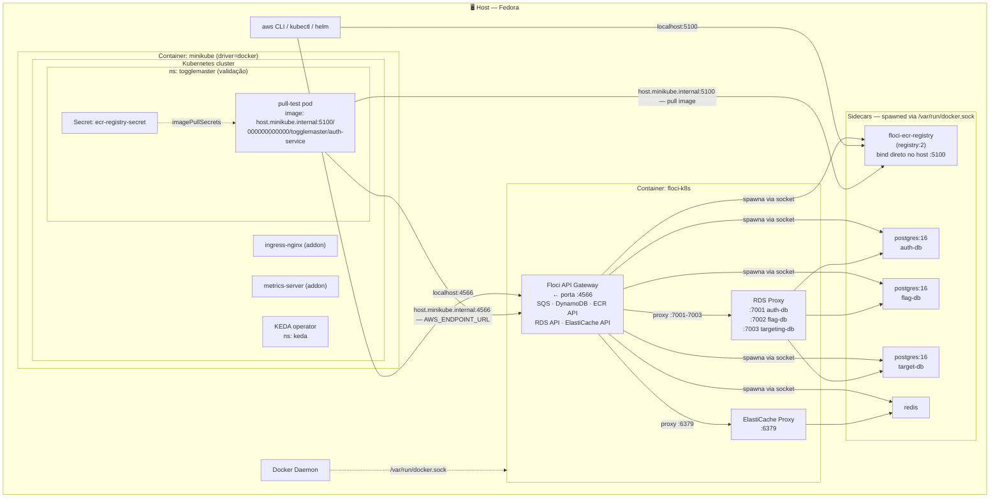

# Validação de Infra Local — pré-requisito para os manifestos K8s

Objetivo: coletar todos os valores e confirmar que cada componente local funciona antes de escrever qualquer YAML.

---

## Arquitetura local de validação



**Pontos-chave:**

- ECR (`registry:2`) bind **direto no host** `:5100` — não passa pelo container Floci, não precisa de `-p 5100` no docker run
- RDS e ElastiCache **passam pelo proxy Floci** → precisam de `-p 6379-6399` e `-p 7001-7099`
- minikube usa `host.minikube.internal` como gateway para tudo no host
- Namespace `togglemaster` é só para validação — manifestos reais usam 5 namespaces separados (um por serviço)
- Credenciais AWS fake (`test`/`test`) via env var inline — nunca `aws configure` (não polui `~/.aws`)

---

## Por que o RDS deu erro no Floci

O Floci atual (docker-compose fase 1) **não monta `/var/run/docker.sock`**. Serviços Docker-backed (RDS, ElastiCache, ECR, EKS) fazem spawn de containers irmãos — sem o socket, todos falham com `java.net.SocketException: No such file or directory`.

Para a fase K8s, o Floci precisa rodar com socket montado + `user: root`. Isso é uma **instância separada** da stack fase 1 — não altera o docker-compose.yaml existente.

---

## ETAPA 0 — Inventário de ferramentas

Rodar e coletar output:

```bash
minikube version
kubectl version --client
helm version --short
docker version --format '{{.Server.Version}}'
aws --version
# eksctl NÃO instalado — será instalado na Fase C
```

**Preencher aqui:**

- minikube: minikube version: v1.38.1
- kubectl: Client Version: v1.36.1 Kustomize Version: v5.8.1
- helm: v3.12.1+11.el8+g8cc4ba6
- docker: 29.5.3
- aws-cli: aws-cli/2.34.29 Python/3.14.5 Linux/7.0.12-101.fc43.x86_64 source/x86_64.fedora.43

---

## ETAPA 1 — Floci com Docker socket (instância K8s)

Esta é uma instância **separada** da fase 1. Roda na porta 4566 (mesma) — não conflita com a stack fase 1 se ela estiver down.

### 1.1 Subir Floci com Docker socket

```bash
docker compose -f ./floci/docker-compose.yaml up -d
```

> Configuração em `floci/docker-compose.yaml` + `floci/application.yml`.
> Dados persistidos em `floci/floci-k8s-data/` (criado automaticamente).
> Portas: `4566` API geral, `6379-6399` ElastiCache, `7001-7099` RDS.

### 1.2 Verificar saúde

```bash
curl -s http://localhost:4566/_localstack/health | jq .
```

Esperado: `{"services": {...}, "status": "running"}`

**Preencher:**

- Floci health: [ x] OK / [ ] ERRO → __ok

```
{
  "original_edition": "floci-always-free",
  "version": "1.5.28",
  "services": {
    "ssm": "running",
    "sqs": "running",
    "s3": "running",
    "dynamodb": "running",
    "sns": "running",
    "lambda": "running",
    "apigateway": "running",
    "iam": "running",
    "kafka": "running",
    "elasticache": "running",
    "memorydb": "running",
    "rds": "running",
    "rds-data": "running",
    "neptune": "running",
    "docdb": "running",
    "events": "running",
    "servicediscovery": "running",
    "elasticmapreduce": "running",
    "wafv2": "running",
    "scheduler": "running",
    "logs": "running",
    "monitoring": "running",
    "secretsmanager": "running",
    "apigatewayv2": "running",
    "kinesis": "running",
    "kms": "running",
    "cognito-idp": "running",
    "states": "running",
    "cloudformation": "running",
    "acm": "running",
    "athena": "running",
    "glue": "running",
    "firehose": "running",
    "email": "running",
    "es": "running",
    "ec2": "running",
    "ecs": "running",
    "appconfig": "running",
    "appconfigdata": "running",
    "ecr": "running",
    "tagging": "running",
    "bedrock-runtime": "running",
    "eks": "running",
    "pipes": "running",
    "elasticloadbalancing": "running",
    "codebuild": "running",
    "batch": "running",
    "codedeploy": "running",
    "codepipeline": "running",
    "config": "running",
    "cloudtrail": "running",
    "autoscaling": "running",
    "elasticbeanstalk": "running",
    "backup": "running",
    "transfer": "running",
    "route53": "running",
    "textract": "running",
    "pricing": "running",
    "transcribe": "running",
    "ce": "running",
    "cur": "running",
    "bcm-data-exports": "running",
    "cloudfront": "running",
    "appsync": "running",
    "s3vectors": "running",
    "iot": "running",
    "iotdata": "running"
  },
  "edition": "community"
}
```

_

### 1.3 Testar SQS

```bash
aws --endpoint-url http://localhost:4566 \
    --region us-east-1 \
    --no-sign-request \
    sqs create-queue --queue-name togglemaster-queue

aws --endpoint-url http://localhost:4566 \
    --region us-east-1 \
    --no-sign-request \
    sqs list-queues
```

**Preencher:**

- SQS: [x] OK / [ ] ERRO →  ok

```
"QueueUrl": "http://localhost:4566/000000000000/togglemaster-queue"

{
"QueueUrls": [
 "http://localhost:4566/000000000000/togglemaster-queue"
 ]
}
```

### 1.4 Testar DynamoDB (baseline)

```bash
aws --endpoint-url http://localhost:4566 \
    --region us-east-1 \
    --no-sign-request \
    dynamodb create-table \
    --table-name ToggleMasterAnalytics \
    --attribute-definitions AttributeName=event_id,AttributeType=S \
    --key-schema AttributeName=event_id,KeyType=HASH \
    --billing-mode PAY_PER_REQUEST

aws --endpoint-url http://localhost:4566 \
    --region us-east-1 \
    --no-sign-request \
    dynamodb list-tables
```

**Preencher:**

- DynamoDB: [x] OK / [ ] ERRO → ok

```
{
    "TableDescription": {
        "AttributeDefinitions": [
            {
                "AttributeName": "event_id",
                "AttributeType": "S"
            }
        ],
        "TableName": "ToggleMasterAnalytics",
        "KeySchema": [
            {
                "AttributeName": "event_id",
                "KeyType": "HASH"
            }
        ],
        "TableStatus": "ACTIVE",
        "CreationDateTime": "2026-06-28T13:21:43-03:00",
        "ProvisionedThroughput": {
            "NumberOfDecreasesToday": 0,
            "ReadCapacityUnits": 0,
            "WriteCapacityUnits": 0
        },
        "TableSizeBytes": 0,
        "ItemCount": 0,
        "TableArn": "arn:aws:dynamodb:us-east-1:000000000000:table/ToggleMasterAnalytics",
        "TableId": "f77f82ff-929a-4c59-be4e-51ef83930c0f",
        "BillingModeSummary": {
            "BillingMode": "PAY_PER_REQUEST",
            "LastUpdateToPayPerRequestDateTime": "2026-06-28T13:21:43-03:00"
        },
        "TableClassSummary": {
            "TableClass": "STANDARD"
        },
        "DeletionProtectionEnabled": false,
        "WarmThroughput": {
            "ReadUnitsPerSecond": 0,
            "WriteUnitsPerSecond": 0,
            "Status": "ACTIVE"
        }
    }
}

# resultado do list tables
{
    "TableNames": [
        "ToggleMasterAnalytics"
    ]
}
```

### 1.5 Testar RDS (PostgreSQL — requer Docker socket)

```bash
aws --endpoint-url http://localhost:4566 \
    --region us-east-1 \
    --no-sign-request \
    rds create-db-instance \
    --db-instance-identifier auth-db \
    --db-instance-class db.t3.micro \
    --engine postgres \
    --master-username postgres \
    --master-user-password postgres \
    --allocated-storage 20

# Aguardar ~20s e checar endpoint
aws --endpoint-url http://localhost:4566 \
    --region us-east-1 \
    --no-sign-request \
    rds describe-db-instances \
    --db-instance-identifier auth-db \
    --query 'DBInstances[0].Endpoint'
```

```
# resposta obtida da crioaç:

{
    "DBInstance": {
        "DBInstanceIdentifier": "auth-db",
        "DBInstanceClass": "db.t3.micro",
        "Engine": "postgres",
        "DBInstanceStatus": "available",
        "MasterUsername": "postgres",
        "Endpoint": {
            "Address": "172.17.0.2",
            "Port": 7001
        },
        "AllocatedStorage": 20,
        "PreferredBackupWindow": "04:00-06:00",
        "VpcSecurityGroups": [
            {
                "VpcSecurityGroupId": "sg-00000000",
                "Status": "active"
            }
        ],
        "DBParameterGroups": [
            {
                "DBParameterGroupName": "default.postgres16",
                "ParameterApplyStatus": "in-sync"
            }
        ],
        "AvailabilityZone": "us-east-1b",
        "DBSubnetGroup": {
            "DBSubnetGroupName": "default",
            "DBSubnetGroupDescription": "default subnet group",
            "VpcId": "vpc-default",
            "SubnetGroupStatus": "Complete",
            "Subnets": [
                {
                    "SubnetIdentifier": "subnet-default-c",
                    "SubnetAvailabilityZone": {
                        "Name": "us-east-1c"
                    },
                    "SubnetStatus": "Active"
                },
                {
                    "SubnetIdentifier": "subnet-default-b",
                    "SubnetAvailabilityZone": {
                        "Name": "us-east-1b"
                    },
                    "SubnetStatus": "Active"
                },
                {
                    "SubnetIdentifier": "subnet-default-a",
                    "SubnetAvailabilityZone": {
                        "Name": "us-east-1a"
                    },
                    "SubnetStatus": "Active"
                }
            ],
            "DBSubnetGroupArn": "arn:aws:rds:us-east-1:000000000000:subgrp:default"
        },
        "PreferredMaintenanceWindow": "mon:00:00-mon:03:00",
        "MultiAZ": false,
        "EngineVersion": "16.3",
        "PubliclyAccessible": false,
        "StorageType": "gp2",
        "DbiResourceId": "db-6FBCF8BCECBD481893616278",
        "DBInstanceArn": "arn:aws:rds:us-east-1:000000000000:db:auth-db",
        "IAMDatabaseAuthenticationEnabled": false,
        "TagList": []
    }
}

# resposta da query da instanacias
{
    "Address": "172.17.0.2",
    "Port": 7001
}
```

Verificar: o `docker ps` mostrará um novo container `postgres:16-alpine` surgindo.

**Preencher:**

- RDS endpoint.Address:  172.17.0.2
- RDS endpoint.Port: ______7001_____
- Container visível em `docker ps`: [x ] Sim / [ ] Não

```
docker ps
CONTAINER ID IMAGE COMMAND CREATED STATUS PORTS NAMES
f7781dbeedc5 postgres:16.3-alpine "docker-entrypoint.s…" About a minute ago Up About a minute 5432/tcp
```

### 1.6 Testar ElastiCache (Redis — requer Docker socket)

```bash
aws --endpoint-url http://localhost:4566 \
    --region us-east-1 \
    --no-sign-request \
    elasticache create-replication-group \
    --replication-group-id togglemaster-redis \
    --replication-group-description "ToggleMaster Redis" \
    --cache-node-type cache.t3.micro \
    --engine redis \
    --num-cache-clusters 1

# Aguardar ~15s e checar endpoint
aws --endpoint-url http://localhost:4566 \
    --region us-east-1 \
    --no-sign-request \
    elasticache describe-replication-groups \
    --replication-group-id togglemaster-redis \
    --query 'ReplicationGroups[0].NodeGroups[0].PrimaryEndpoint'
```

**Preencher:**

- ElastiCache Address: 

```
{
    "ReplicationGroup": {
        "ReplicationGroupId": "togglemaster-redis",
        "Description": "ToggleMaster Redis",
        "Status": "available",
        "AutomaticFailover": "disabled",
        "MultiAZ": "disabled",
        "ConfigurationEndpoint": {
            "Address": "localhost",
            "Port": 6379
        },
        "SnapshotRetentionLimit": 0,
        "ClusterEnabled": false,
        "AuthTokenEnabled": false,
        "TransitEncryptionEnabled": false,
        "AtRestEncryptionEnabled": false
    }
}
```

- ElastiCache Port: ______6379_____
- Container visível em `docker ps`: [ x] Sim / [ ] Não

```
f87b0516742e valkey/valkey:8 "docker-entrypoint.s…" 50 seconds ago Up 49 seconds 6379/tcp floci-valkey-togglemaster-redis
```

### 1.7 Testar ECR (requer Docker socket)

Floci ECR usa sidecar `registry:2` real no range fixo `5100-5199`. O problema anterior (hostname não-roteável) foi resolvido com `uri-style: path` no `application.yml` — URI retorna `localhost:5100/000000000000/repo` em vez de `000000000000.dkr.ecr.us-east-1.localhost:5100`.

**Credenciais fake via env var** (não usar `aws configure` — polui `~/.aws/credentials`):

```bash
# Criar 5 repositórios ECR
for SVC in auth-service flag-service targeting-service evaluation-service analytics-service; do
  aws --endpoint-url http://localhost:4566 --region us-east-1 --no-sign-request \
    ecr create-repository --repository-name togglemaster/$SVC
done

# Login path-style (env vars inline — sem escrita em disco)
AWS_ACCESS_KEY_ID=test AWS_SECRET_ACCESS_KEY=test AWS_DEFAULT_REGION=us-east-1 \
aws ecr get-login-password --endpoint-url http://localhost:4566 | \
  docker login --username AWS --password-stdin localhost:5100
```

**Preencher:**

- Repositórios criados: [x] OK / [ ] ERRO
- URI retornada: `localhost:5100/000000000000/togglemaster/<svc>` [ ] confirmado
- docker login localhost:5100: [x] OK / [ ] ERRO

```
WARNING! Your credentials are stored unencrypted in '/home/alan/.docker/config.json'.
Configure a credential helper to remove this warning. See
https://docs.docker.com/go/credential-store/

Login Succeeded
```

### 1.8 Decisão: Floci ECR vs NAS registry

**DECISÃO: Floci ECR (path-style)** — simula workflow real `aws ecr get-login-password`, URI roteável via `host.minikube.internal:5100`.

| Critério                                                | Floci ECR path-style | NAS registry             |
| ------------------------------------------------------- | -------------------- | ------------------------ |
| Simula workflow ECR real (`aws ecr get-login-password`) | **Sim** ✓            | Não                      |
| URI roteável de dentro do minikube                      | **Sim** ✓            | Sim                      |
| Porta fixa                                              | **Sim** (5100) ✓     | Sim (5000)               |
| Preparação para Fase C (ECR real)                       | **Sim** ✓            | Não (workflow diferente) |

---

## ETAPA 2 — Floci ECR (path-style)

### 2.1 Login no Floci ECR

ECR já configurado em 1.7. Confirmação de login (credenciais via env var — sem `aws configure`):

```bash
AWS_ACCESS_KEY_ID=test AWS_SECRET_ACCESS_KEY=test AWS_DEFAULT_REGION=us-east-1 \
aws ecr get-login-password --endpoint-url http://localhost:4566 | \
  docker login --username AWS --password-stdin localhost:5100
```

**Preencher:**

- docker login localhost:5100: [x ] OK / [ ] ERRO

### 2.2 Testar build e push do host para Floci ECR

```bash
REGISTRY=localhost:5100/000000000000

# Usar auth-service como imagem de teste (já tem Dockerfile multi-stage)
docker build -t $REGISTRY/togglemaster/auth-service:latest ./auth-service
docker push $REGISTRY/togglemaster/auth-service:latest
```

**Preencher:**

- docker build auth-service: [x] OK / [ ] ERRO
- docker push localhost:5100/...: [x] OK / [ ] ERRO

```
docker push $REGISTRY/togglemaster/auth-service:latest
The push refers to repository [localhost:5100/000000000000/togglemaster/auth-service]
ad8346072e58: Pushed 
02fb2cc15ec4: Pushed 
e8575cafe718: Pushed 
0b44b2151d78: Pushed 
latest: digest: sha256:8e64cd3a75ac3fc981f7706f0a6dee6e3473330cb0baac5a581953894c705d75 size: 1155
```

### 2.3 Configurar minikube para Floci ECR

```bash
# minikube com insecure-registry apontando para Floci ECR via host.minikube.internal
minikube delete

minikube start \
  --insecure-registry="host.minikube.internal:5100" \
  --cpus=4 \
  --memory=6144 \
  --driver=docker

minikube addons enable ingress
minikube addons enable metrics-server

# Namespace de validação + secret (togglemaster — somente para este teste)
kubectl create namespace togglemaster
kubectl create secret docker-registry ecr-registry-secret \
  --docker-server=host.minikube.internal:5100 \
  --docker-username=AWS \
  --docker-password=test \
  --namespace=togglemaster

# Teste de pull do Floci ECR de dentro do cluster
kubectl run pull-test \
  --image=host.minikube.internal:5100/000000000000/togglemaster/auth-service:latest \
  --restart=Never \
  --namespace=togglemaster \
  --overrides='{"spec":{"imagePullSecrets":[{"name":"ecr-registry-secret"}]}}' \
  -- sleep 5

kubectl get pod pull-test -n togglemaster
kubectl delete pod pull-test -n togglemaster
```

**Status:**

- minikube start: [x ] OK
- Pull com `ecr-registry-secret`: [x ] Completed / [ ] ERRO

**Decisão de design:** `imagePullSecrets` declarado explicitamente em **cada** Deployment/StatefulSet/Job — não via patch no service account.

Motivo: manifesto é fonte de verdade. Quem lê o YAML vê a dependência. Na migração pro EKS (Fase C), o bloco some cirurgicamente (IRSA assume) e a troca é rastreável no git.

Bloco obrigatório em todo objeto K8s com imagem do Floci ECR:

```yaml
spec:
  template:
    spec:
      imagePullSecrets:
        - name: ecr-registry-secret
      containers:
        - name: <service>
          image: host.minikube.internal:5100/000000000000/togglemaster/<service>:latest
```

---

## ETAPA 3 — Conectividade minikube → Floci

Os pods do minikube precisam alcançar o Floci rodando no host via `host.minikube.internal`.

### 3.1 Verificar resolução

Imagem do teste vem do Floci ECR (não Docker Hub). Primeiro push `alpine` pro ECR, depois rodar pod com `imagePullSecrets`.

```bash
REGISTRY=localhost:5100/000000000000

# Push curlimages/curl para Floci ECR (se ainda não foi feito)
docker pull curlimages/curl:latest
docker tag curlimages/curl:latest $REGISTRY/togglemaster/curl:latest
docker push $REGISTRY/togglemaster/curl:latest

# Testar se host.minikube.internal resolve de dentro do cluster
kubectl run connectivity-test \
  --image=host.minikube.internal:5100/000000000000/togglemaster/curl:latest \
  --restart=Never \
  --rm -it \
  --namespace=togglemaster \
  --overrides='{"spec":{"imagePullSecrets":[{"name":"ecr-registry-secret"}]}}' \
  -- curl -s http://host.minikube.internal:4566/_localstack/health
```

Esperado: JSON com status do Floci.

**Preencher:**

- Resolução `host.minikube.internal`: [ x] OK / [ ] FALHOU → ___

```
{"original_edition":"floci-always-free","version":"1.5.28","services":{"ssm":"running","sqs":"running","s3":"running","dynamodb":"running","sns":"running","lambda":"running","apigateway":"running","iam":"running","kafka":"running","elasticache":"running","memorydb":"running","rds":"running","rds-data":"running","neptune":"running","docdb":"running","events":"running","servicediscovery":"running","elasticmapreduce":"running","wafv2":"running","scheduler":"running","logs":"running","monitoring":"running","secretsmanager":"running","apigatewayv2":"running","kinesis":"running","kms":"running","cognito-idp":"running","states":"running","cloudformation":"running","acm":"running","athena":"running","glue":"running","firehose":"running","email":"running","es":"running","ec2":"running","ecs":"running","appconfig":"running","appconfigdata":"running","ecr":"running","tagging":"running","bedrock-runtime":"running","eks":"running","pipes":"running","elasticloadbalancing":"running","codebuild":"running","batch":"running","codedeploy":"running","codepipeline":"running","config":"running","cloudtrail":"running","autoscaling":"running","elasticbeanstalk":"running","backup":"running","transfer":"running","route53":"running","textract":"running","pricing":"running","transcribe":"running","ce":"running","cur":"running","bcm-data-exports":"running","cloudfront":"running","appsync":"running","s3vectors":"running","iot":"running","iotdata":"running"},"edition":"community"}pod "connectivity-test" deleted from default namespace
```

__

### 3.2 Verificar SQS de dentro do cluster

`amazon/aws-cli` tem `aws` como entrypoint — args após `--` não devem repetir `aws`.

```bash
REGISTRY=localhost:5100/000000000000

# Push amazon/aws-cli para Floci ECR (uma vez)
docker pull amazon/aws-cli:latest
docker tag amazon/aws-cli:latest $REGISTRY/togglemaster/aws-cli:latest
docker push $REGISTRY/togglemaster/aws-cli:latest

# Testar SQS de dentro do cluster
kubectl run sqs-test \
  --image=host.minikube.internal:5100/000000000000/togglemaster/aws-cli:latest \
  --restart=Never \
  --rm -it \
  --namespace=togglemaster \
  --overrides='{"spec":{"imagePullSecrets":[{"name":"ecr-registry-secret"}]}}' \
  -- sqs list-queues \
     --endpoint-url http://host.minikube.internal:4566 \
     --region us-east-1 \
     --no-sign-request
```

Esperado: lista com `togglemaster-queue`.

**Preencher:**

- SQS acessível do cluster: [x] OK — `togglemaster-queue` listada de dentro do cluster via `host.minikube.internal:4566`

```
{
    "QueueUrls": [
        "http://localhost:4566/000000000000/togglemaster-queue"
    ]
}
```

___

---

## ETAPA 4 — KEDA (pré-validação)

```bash
helm repo add kedacore https://kedacore.github.io/charts
helm repo update
helm install keda kedacore/keda --namespace keda --create-namespace

kubectl get pods -n keda --watch
```

Esperado: `keda-operator-*` e `keda-operator-metrics-apiserver-*` Running.

```
keda-operator-metrics-apiserver-589688768f-v2xl7   1/1     Running   1 (7s ago)    23s
keda-operator-69f7467655-n4vpf                     1/1     Running   1 (28s ago)   36s
keda-admission-webhooks-d6dc4d56f-p2f4j            1/1     Running   1 (28s ago)   39s
```

```bash
# Verificar TriggerAuthentication para Floci (sem creds reais)
# KEDA precisa de um provider AWS — com fake creds para Floci
kubectl create secret generic keda-floci-creds \
  --from-literal=AWS_ACCESS_KEY_ID=test \
  --from-literal=AWS_SECRET_ACCESS_KEY=test \
  -n togglemaster
```

**Preencher:**

- KEDA pods Running: [x] Sim — `keda-operator-*` e `keda-operator-metrics-apiserver-*` Running
- KEDA conecta na SQS Floci: será testado após deploy do ScaledObject na Fase B

---

## ETAPA 5 — Consolidação: valores para os manifestos

Após completar etapas 1-4, preencher esta tabela. Ela alimenta os ConfigMaps e Secrets.

### Valores locais (minikube)

| Variável                      | Fonte                                       | Valor                                                                |
| ----------------------------- | ------------------------------------------- | -------------------------------------------------------------------- |
| `DATABASE_URL` auth-db        | Floci RDS endpoint (1.5) ou StatefulSet K8s | `postgresql://postgres:postgres@___:5432/auth_db`                    |
| `DATABASE_URL` flags-db       | idem                                        | `postgresql://postgres:postgres@___:5432/flags_db`                   |
| `DATABASE_URL` targeting-db   | idem                                        | `postgresql://postgres:postgres@___:5432/targeting_db`               |
| `REDIS_URL`                   | Floci ElastiCache (1.6) ou StatefulSet K8s  | `redis://___:6379`                                                   |
| `AWS_ENDPOINT_URL`            | host.minikube.internal                      | `http://host.minikube.internal:4566`                                 |
| `AWS_SQS_URL`                 | Floci SQS (1.3)                             | `http://host.minikube.internal:4566/000000000000/togglemaster-queue` |
| `AWS_DYNAMODB_TABLE`          | fixo                                        | `ToggleMasterAnalytics`                                              |
| `AWS_REGION`                  | fixo                                        | `us-east-1`                                                          |
| `AWS_ACCESS_KEY_ID`           | fake para Floci                             | `test`                                                               |
| `AWS_SECRET_ACCESS_KEY`       | fake para Floci                             | `test`                                                               |
| `MASTER_KEY`                  | fixo                                        | `admin-secreto-123`                                                  |
| `SERVICE_API_KEY`             | gerado no primeiro boot                     | `tm_key_XXXX` (preencher após deploy)                                |
| `AUTH_SERVICE_URL`            | ClusterDNS                                  | `http://auth-service.auth-service.svc.cluster.local:8001`            |
| `FLAG_SERVICE_URL`            | ClusterDNS                                  | `http://flag-service.flag-service.svc.cluster.local:8002`            |
| `TARGETING_SERVICE_URL`       | ClusterDNS                                  | `http://targeting-service.targeting-service.svc.cluster.local:8003`  |
| Registry (Floci ECR)          | 1.7 + Etapa 2                               | `host.minikube.internal:5100`                                        |
| image format                  | Etapa 2                                     | `host.minikube.internal:5100/000000000000/togglemaster/<svc>:latest` |
| `imagePullSecrets` necessário | Etapa 2.3                                   | [x] Sim → `ecr-registry-secret` por namespace                        |
| `AWS_ENDPOINT_URL` (pods)     | Etapa 3.1                                   | `http://host.minikube.internal:4566`                                 |
| `AWS_SQS_URL` (pods)          | Etapa 1.3                                   | `http://host.minikube.internal:4566/000000000000/togglemaster-queue` |

### Decisões resultantes

**[x] Floci RDS funcionou?** — SIM → pods usam `host.minikube.internal:7001` (auth-db), `:7002` (flag-db), `:7003` (targeting-db) — sem StatefulSets K8s

**[x] Floci ElastiCache funcionou?** — SIM → pods usam `host.minikube.internal:6379` — sem StatefulSet redis K8s

**[x] Registry escolhido:** Floci ECR path-style → `host.minikube.internal:5100` + `ecr-registry-secret`

**[x] KEDA instalado** → namespace `keda`, ScaledObject em `analytics-service`, trigger SQS `togglemaster-queue` via `host.minikube.internal:4566`

---

## Resultado esperado desta etapa

Ao final, você tem:

1. Floci rodando com `application.yml` — SQS, DynamoDB, RDS, ElastiCache, ECR funcionando
2. Floci ECR path-style validado: push do host + pull de dentro do minikube com `ecr-registry-secret`
3. Conectividade minikube → Floci confirmada via `host.minikube.internal:4566`
4. KEDA instalado no namespace `keda`
5. Tabela de valores preenchida

**Com isso em mãos: escrever os manifestos leva 1 sessão sem bloqueios.**

---

> **Gap detectado durante deploy K8s:** no docker-compose, o postgres aplicava `init.sql` automaticamente via `docker-entrypoint-initdb.d`. No Floci RDS esse mecanismo não existe — as tabelas nunca eram criadas, causando falha silenciosa (app sobe, `/health` responde 200, mas qualquer query falha com "relation does not exist").
>
> **Fix aplicado nos apps:** `auth-service/main.go` usa `//go:embed db/init.sql` + `db.Exec(initSQL)` no startup. `flag-service/app.py` e `targeting-service/app.py` executam `db/init.sql` via psycopg2 após pool init. `CREATE TABLE IF NOT EXISTS` — idempotente. Os Dockerfiles de flag e targeting incluem `COPY db/ db/`.

---

## TEARDOWN — Apagar tudo e refazer do zero

Ordem importa: K8s primeiro, depois Floci, depois minikube.

### 1. Remover recursos K8s

```bash
helm uninstall keda -n keda
kubectl delete namespace keda
kubectl delete namespace togglemaster
kubectl delete pod --all -n default --force --grace-period=0
```

### 2. Parar e remover Floci

```bash
docker compose -f ./floci/docker-compose.yaml down
```

### 3. Limpar credenciais Floci ECR do Docker

```bash
docker logout localhost:5100
```

### 4. Deletar minikube

```bash
minikube delete
```

### 5. Recriar tudo (ordem exata)

```bash
# 1. Floci
docker compose -f ./floci/docker-compose.yaml up -d

sleep 10

# 2. Recriar recursos AWS (skip se dados persistiram em floci/floci-k8s-data/)
aws --endpoint-url http://localhost:4566 --region us-east-1 --no-sign-request \
  sqs create-queue --queue-name togglemaster-queue

aws --endpoint-url http://localhost:4566 --region us-east-1 --no-sign-request \
  dynamodb create-table --table-name ToggleMasterAnalytics \
  --attribute-definitions AttributeName=event_id,AttributeType=S \
  --key-schema AttributeName=event_id,KeyType=HASH \
  --billing-mode PAY_PER_REQUEST

# 3. Criar repositórios ECR + login
for SVC in auth-service flag-service targeting-service evaluation-service analytics-service; do
  aws --endpoint-url http://localhost:4566 --region us-east-1 --no-sign-request \
    ecr create-repository --repository-name togglemaster/$SVC
done

AWS_ACCESS_KEY_ID=test AWS_SECRET_ACCESS_KEY=test AWS_DEFAULT_REGION=us-east-1 \
aws ecr get-login-password --endpoint-url http://localhost:4566 | \
  docker login --username AWS --password-stdin localhost:5100

# 4. Build e push dos 5 serviços
REGISTRY=localhost:5100/000000000000
for SVC in auth-service flag-service targeting-service evaluation-service analytics-service; do
  docker build -t $REGISTRY/togglemaster/$SVC:latest ./$SVC
  docker push $REGISTRY/togglemaster/$SVC:latest
done

# 5. minikube com Floci ECR insecure-registry + addons
minikube start \
  --insecure-registry="host.minikube.internal:5100" \
  --cpus=4 --memory=6144 --driver=docker

minikube addons enable ingress
minikube addons enable metrics-server

# 6. Namespaces dos 5 serviços + ecr-registry-secret em cada um (para manifestos K8s)
for NS in auth-service flag-service targeting-service evaluation-service analytics-service; do
  kubectl create namespace $NS
  kubectl create secret docker-registry ecr-registry-secret \
    --docker-server=host.minikube.internal:5100 \
    --docker-username=AWS \
    --docker-password=test \
    --namespace=$NS
done

# 7. KEDA
helm repo add kedacore https://kedacore.github.io/charts && helm repo update
helm install keda kedacore/keda --namespace keda --create-namespace

# 8. Secret KEDA (analytics-service — onde o ScaledObject vai viver)
kubectl create secret generic keda-floci-creds \
  --from-literal=AWS_ACCESS_KEY_ID=test \
  --from-literal=AWS_SECRET_ACCESS_KEY=test \
  -n analytics-service

# Verificar
kubectl get pods -n keda
kubectl get namespaces
```
