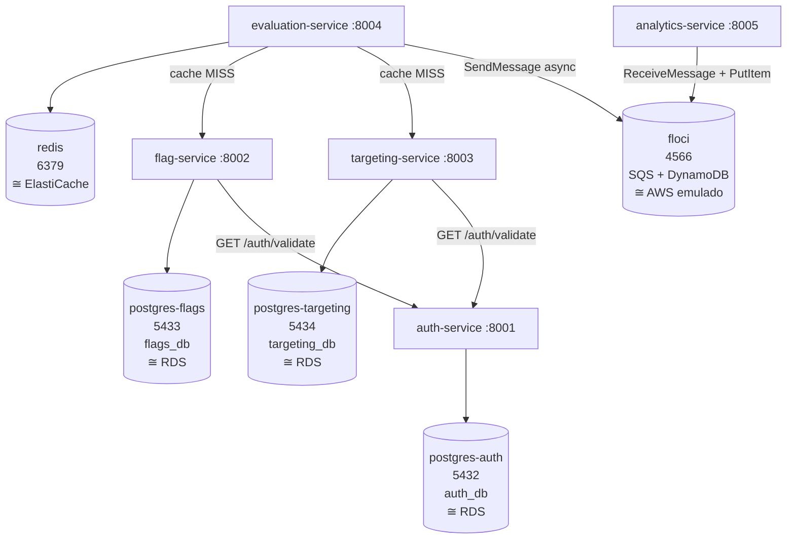

# ToggleMaster — Fase 2: Plano de Containerização

## Arquitetura da Stack — 10 containers



```
INFRA (5):
  postgres-auth-DB1       :5432  ← auth-service       (banco: auth_db)       ≅ RDS PostgreSQL
  postgres-flags-DB2      :5433  ← flag-service        (banco: flags_db)      ≅ RDS PostgreSQL
  postgres-targeting-DB3  :5434  ← targeting-service   (banco: targeting_db)  ≅ RDS PostgreSQL
  redis-DB4               :6379  ← evaluation-service  (cache de avaliações)  ≅ ElastiCache (Redis)
  floci-DB5               :4566  ← evaluation-service  (publica eventos SQS)  ≅ AWS SQS + DynamoDB
                                 ← analytics-service  (consome SQS + grava DynamoDB)

  Nota: em K8s/Floci, redis e postgres rodam como containers Floci — mesmas portas, mesmo propósito.

APPS (5):
  auth-service-APP1       :8001
  flag-service-APP2       :8002
  targeting-service-APP3  :8003
  evaluation-service-APP4 :8004
  analytics-service-APP5  :8005
```

> **PDF diz 9 containers** — está errado. Cada serviço tem seu próprio `db/init.sql`, logo precisa de banco separado. 3 postgres = correto.

> **Por que Floci existe aqui:** o trabalho original usava `amazon/dynamodb-local` para DynamoDB e SQS real da AWS (credenciais no `.env`). Para validar localmente sem conta AWS e sem LocalStack (descontinuado março/2026), o `dynamodb-local` + SQS real foram substituídos pelo Floci, que emula ambos na porta 4566. Floci é MIT, sem auth, drop-in.

### Estado original — o que existia antes do Floci

**Container original (`docker-compose.yaml`):**

```yaml
dynamodb-local:
  container_name: dynamodb-local-DB5
  image: amazon/dynamodb-local:latest
  ports:
    - "8000:8000"
  command: ["-jar", "DynamoDBLocal.jar", "-sharedDb", "-inMemory"]
```

**`.env` original (SQS real):**

```env
AWS_REGION=us-east-1
AWS_ACCESS_KEY_ID=<credencial real>
AWS_SECRET_ACCESS_KEY=<credencial real>
#AWS_SESSION_TOKEN=<se AWS Academy>
AWS_SQS_URL=https://sqs.us-east-1.amazonaws.com/CONTA/FILA
```

**`analytics-service` original:**

- Lia `AWS_SQS_URL` do `.env` → conectava no SQS real
- DynamoDB endpoint: AWS real (sem `AWS_ENDPOINT_URL` → boto3 usava AWS diretamente)

### Estado atual — com Floci

```yaml
floci:
  container_name: floci-DB5
  image: floci/floci:latest-compat
  ports:
    - "4566:4566"
  environment:
    FLOCI_HOSTNAME: floci
    FLOCI_BASE_URL: http://floci:4566
    FLOCI_DEFAULT_REGION: ${AWS_REGION}
  volumes:
    - ./scripts/floci-init.sh:/etc/localstack/init/ready.d/init.sh
  healthcheck:
    test: ["CMD", "curl", "-f", "http://localhost:4566/_localstack/health"]
    interval: 5s
    timeout: 2s
    retries: 10
    start_period: 15s
```

> *AWS_REGION=us-east-1 declarado no .env da stack

**`.env` com Floci (fake creds — local only):**

```env
AWS_REGION=us-east-1
AWS_ACCESS_KEY_ID=test
AWS_SECRET_ACCESS_KEY=test
AWS_ENDPOINT_URL=http://floci:4566
AWS_SQS_URL=http://floci:4566/000000000000/togglemaster-queue
AWS_DYNAMODB_TABLE=ToggleMasterAnalytics
```

> **Floci é infraestrutura local apenas. Essas envs foram adicionadas no .env da stack** Em produção (EKS): remove o container, usa SQS + DynamoDB reais da AWS com IRSA.

---

## O que mudou vs o código original

### Bugs Go — CORRIGIDOS ✅ (commitados)

**Commit `auth-service` — `d8004b8` "go mod tidy para gerar novo go.mod e dockerfile adicionado"**

```diff
# handlers.go
-    "crypto/sha256"
-    "encoding/hex"
     "encoding/json"

# key.go
     "crypto/rand"
     "crypto/sha256"
     "encoding/hex"
-    "fmt"

# main.go
-    "fmt"
     "log"
-    "github.com/jackc/pgx/v4/stdlib"
+    _ "github.com/jackc/pgx/v4/stdlib"
```

`go.sum` gerado com `go mod tidy` (arquivo estava ausente — build em container falhava).

**Commit `evaluation-service` — `546c6c8` "go.sum deletado e gerado novamente"**

```diff
# evaluator.go
-    "context"
     "crypto/sha1"
     "encoding/binary"
     "encoding/json"
     "fmt"
     "io/ioutil"
     "log"
     "net/http"
     "sync"
     "time"
+    "os"
```

`go.sum` estava corrompido (continha conteúdo do `go.mod`). Deletado e regenerado.

> `io/ioutil` ainda presente — deprecated desde Go 1.16 mas compila em Go 1.21. Não bloqueia build.

**`evaluation-service/main.go` — SQS endpoint para dev local**

`aws-sdk-go` v1 (Go) **não lê `AWS_ENDPOINT_URL` do ambiente** — apenas `boto3 >= 1.28.0` faz isso automaticamente. Sem esse fix, o SDK Go ignora `AWS_ENDPOINT_URL=http://floci:4566` e tenta conectar na AWS real com credenciais `test/test` → `InvalidClientTokenId`.

```diff
# main.go — criação da sessão SQS
+    // aws-sdk-go v1 não lê AWS_ENDPOINT_URL do ambiente (apenas boto3 >= 1.28.0 faz isso).
+    // Lemos manualmente para redirecionar para o Floci em dev local.
     cfg := &aws.Config{Region: aws.String(awsRegion)}
+    if endpoint := os.Getenv("AWS_ENDPOINT_URL"); endpoint != "" {
+        cfg.Endpoint = aws.String(endpoint)
+    }
     sess, err := session.NewSession(cfg)
```

**Seguro para EKS:** quando `AWS_ENDPOINT_URL` não está definida (prod), `cfg.Endpoint` fica `nil` e o SDK usa os endpoints reais da AWS — comportamento idêntico ao original. A var só existe no `.env` local.

> **Para reverter:** remover o bloco `if endpoint := ...` de `evaluation-service/main.go`. Em prod o código original funciona porque o SDK usa AWS real sem precisar do env var.

### Dependências Python — CORRIGIDAS ✅

**Por que quebravam:** `uv` resolvia `werkzeug` para 3.x; Flask 2.2.2 usa `werkzeug.urls.url_quote` removido na werkzeug 2.4+ → `ImportError` no startup. Gunicorn 20.1.0 importava `pkg_resources` ausente em `python:3.11-slim` → `ModuleNotFoundError`.

**Fix:** upgrade para versões compatíveis.

#### `flag-service/pyproject.toml` — diff real

```diff
-    "flask==2.2.2",
-    "psycopg2-binary==2.9.5",
-    "gunicorn==20.1.0",
+    "flask==3.0.0",
+    "werkzeug==3.0.1",
+    "psycopg2-binary==2.9.5",
+    "gunicorn==22.0.0",
     "python-dotenv==0.21.0",
     "requests==2.28.1",
```

#### `targeting-service/pyproject.toml` — diff real

```diff
-    "flask==2.2.2",
+    "flask==3.0.0",
+    "werkzeug==3.0.1",
     "psycopg2-binary==2.9.5",
-    "gunicorn==20.1.0",
+    "gunicorn==22.0.0",
     "python-dotenv==0.21.0",
     "requests==2.28.1",
```

#### `analytics-service/pyproject.toml` — diff real

```diff
-    "flask==2.2.2",
-    "gunicorn==20.1.0",
+    "flask==3.0.0",
+    "werkzeug==3.0.1",
+    "gunicorn==22.0.0",
     "python-dotenv==0.21.0",
-    "boto3==1.26.50",
+    "boto3==1.34.0",
```

> **Por que boto3 1.34.0:** `AWS_ENDPOINT_URL` global (que redireciona boto3 para o Floci sem alterar código Python) foi adicionada ao boto3 em 1.28.0. Com 1.26.50 precisaria alterar `app.py` para passar `endpoint_url` em cada `boto3.client()`.

### O que mudou no código Python — `app.py`

**`flag-service/app.py`** e **`targeting-service/app.py`** — dois fixes:

**Fix 1 — JSON encoding de acentos (`ensure_ascii`):**

```python
# ANTES (Flask 3.0 padrão — escapa não-ASCII):
# {"error":"Chave de API inválida"}

# DEPOIS:
app.json.ensure_ascii = False
# {"error":"Chave de API inválida"}
```

**Fix 2 — Timestamp com offset local (`BRJSONProvider`):**

Flask 3.0 serializa `datetime` com `http_date()` (RFC 2822), que **sempre converte para UTC** antes de formatar:

```python
# ANTES: "2026-06-24T23:30:15-03:00" do PostgreSQL → Flask → "Thu, 25 Jun 2026 02:30:15 GMT"

# DEPOIS — custom JSON provider com isoformat():
from flask.json.provider import DefaultJSONProvider
import datetime

class BRJSONProvider(DefaultJSONProvider):
    # isoformat() preserva o offset do banco: "2026-06-24T23:30:15.053189-03:00"
    def default(self, o):
        if isinstance(o, (datetime.datetime, datetime.date)):
            return o.isoformat()
        return super().default(o)

app = Flask(__name__)
app.json_provider_class = BRJSONProvider
app.json = BRJSONProvider(app)
app.json.ensure_ascii = False
```

**`analytics-service/app.py`** — só `ensure_ascii = False` (sem datetimes nas respostas).

> **Para reverter:** remover o bloco `class BRJSONProvider` e as 2 linhas `app.json_provider_class` / `app.json = BRJSONProvider(app)` de `flag-service/app.py` e `targeting-service/app.py`. Remover `app.json.ensure_ascii = False` dos 3 arquivos.

### Schema migration — CORRIGIDO ✅

**Problema:** o docker-compose montava `init.sql` em `docker-entrypoint-initdb.d` nos containers postgres — o postgres aplicava o schema automaticamente no primeiro boot. Isso mascarou que o app nunca foi responsável pela própria migração. Ao mover para K8s (Floci RDS), esse mecanismo não existe: o schema nunca era criado, queries falhavam com `relation does not exist` mesmo com o pod Running e `/health` respondendo 200.

**Fix — `entrypoint.sh` por serviço (auth, flag, targeting):**

`entrypoint.sh` roda `psql` antes de subir o app. O código da aplicação não muda — migration fica fora do código de negócio.

```sh
#!/bin/sh
set -e
psql "$DATABASE_URL" -f /app/init.sql
exec /app/auth-service          # flag: gunicorn app:app --bind 0.0.0.0:8002 --workers 2
                                 # targeting: gunicorn app:app --bind 0.0.0.0:8003 --workers 2
```

**Fix — Dockerfiles (auth, flag, targeting):**

```diff
+RUN apk --no-cache add ... postgresql16-client    # Alpine (auth)
+# ou: apt-get install -y ... postgresql-client    # Debian (flag/targeting)

 COPY --from=builder /app/auth-service .   # ou: COPY app.py .
+COPY db/init.sql .
+COPY entrypoint.sh .
+RUN chmod +x ./entrypoint.sh
-CMD ["./auth-service"]
+ENTRYPOINT ["./entrypoint.sh"]
```

**Fix — `docker-compose.yaml`** — volumes `docker-entrypoint-initdb.d` removidos dos 3 postgres:

```diff
-      - ./auth-service/db/init.sql:/docker-entrypoint-initdb.d/init.sql
       - pg_auth_data:/var/lib/postgresql/data
```

`CREATE TABLE IF NOT EXISTS` — idempotente, funciona no primeiro boot e nos seguintes. `set -e` no entrypoint garante que se o `psql` falhar o container não sobe.

**Validação docker-compose:**

```bash
docker compose logs auth-service | head -5
# esperado: primeira linha = saída do psql (CREATE TABLE), depois app sobe

docker compose exec postgres-auth psql -U postgres -d auth_db -c "\dt"
# esperado: api_keys
```

**Validação K8s:**

```bash
NEWPOD=$(kubectl get pods -n auth-service --sort-by=.metadata.creationTimestamp -o jsonpath='{.items[-1:].metadata.name}')
kubectl logs -n auth-service "$NEWPOD"
# esperado: CREATE TABLE (psql), depois "Conectado ao PostgreSQL", depois "rodando na porta 8001"
```

> **Rebuild obrigatório** após esse fix — imagens antigas não têm `entrypoint.sh` nem `init.sql` copiados. Ver seção "Rebuild".

---

## O que muda para EKS — checklist completo

### 1. `analytics-service` — variáveis de ambiente

No EKS, o `analytics-service` usa SQS e DynamoDB **reais da AWS**. Nenhuma alteração no código Python (`app.py` zero mudanças). Só as vars de ambiente mudam:

| Variável                | Local (Floci)                                       | EKS (AWS real)                                                                        |
| ----------------------- | --------------------------------------------------- | ------------------------------------------------------------------------------------- |
| `AWS_ENDPOINT_URL`      | `http://floci:4566`                                 | **Remover** — sem essa var boto3 vai direto para AWS                                  |
| `AWS_ACCESS_KEY_ID`     | `test`                                              | **Remover** — EKS usa IRSA (IAM Role para Service Account)                            |
| `AWS_SECRET_ACCESS_KEY` | `test`                                              | **Remover** — idem IRSA                                                               |
| `AWS_REGION`            | `us-east-1`                                         | Manter — usar a região real do deploy                                                 |
| `AWS_SQS_URL`           | `http://floci:4566/000000000000/togglemaster-queue` | **Trocar** — URL real: `https://sqs.<region>.amazonaws.com/<account-id>/<queue-name>` |
| `AWS_DYNAMODB_TABLE`    | `ToggleMasterAnalytics`                             | Manter — mesmo nome, tabela criada na AWS                                             |

> **IRSA no EKS:** ao invés de credenciais, o pod recebe uma IAM Role via Service Account. O boto3 detecta automaticamente. Sem chave, sem secret no manifest.

### 2. `scripts/floci-init.sh` — NÃO vai para EKS

Esse script existe **apenas para criar recursos locais no Floci**. No EKS os recursos precisam existir antes do deploy:

| Recurso                                                                                | Local                               | EKS                                                     |
| -------------------------------------------------------------------------------------- | ----------------------------------- | ------------------------------------------------------- |
| Fila SQS `togglemaster-queue`                                                          | Criada pelo `floci-init.sh` no boot | Criar via **Terraform / CDK / Console** antes do deploy |
| Tabela DynamoDB `ToggleMasterAnalytics` (PK: `event_id`, tipo String, PAY_PER_REQUEST) | Criada pelo `floci-init.sh` no boot | Criar via **Terraform / CDK / Console** antes do deploy |

O `floci-init.sh` pode servir de referência para o Terraform:

```hcl
# equivalente terraform do que o floci-init.sh faz
resource "aws_sqs_queue" "toggle" {
  name = "togglemaster-queue"
}

resource "aws_dynamodb_table" "analytics" {
  name         = "ToggleMasterAnalytics"
  billing_mode = "PAY_PER_REQUEST"
  hash_key     = "event_id"
  attribute {
    name = "event_id"
    type = "S"
  }
}
```

### 3. Container `floci` — remover do compose EKS

O `floci` container não existe no deploy EKS. O `docker-compose.yaml` atual é para validação local. Para EKS: K8s Deployments + Services + ConfigMaps — sem `floci`, sem `dynamodb-local`.

### 4. Secrets — trocar valores locais

| Secret              | Local                | EKS                                                   |
| ------------------- | -------------------- | ----------------------------------------------------- |
| `POSTGRES_PASSWORD` | `postgres`           | AWS Secrets Manager ou K8s Secret                     |
| `MASTER_KEY`        | `admin-secreto-123`  | K8s Secret                                            |
| `SERVICE_API_KEY`   | gerada no boot local | K8s Secret ou gerada no primeiro Job de inicialização |

---

## Arquivos criados

### Dockerfiles

**auth-service/Dockerfile** (Go + Alpine, com migração via entrypoint.sh):

```dockerfile
FROM golang:1.21-alpine AS builder
WORKDIR /app
COPY go.mod go.sum ./
RUN go mod download
COPY . .
RUN CGO_ENABLED=0 GOOS=linux go build -o auth-service .

FROM alpine:3.19
ENV TZ=America/Sao_Paulo
RUN apk --no-cache add ca-certificates tzdata postgresql16-client && \
    cp /usr/share/zoneinfo/$TZ /etc/localtime && \
    echo $TZ > /etc/timezone
WORKDIR /app
COPY --from=builder /app/auth-service .
COPY db/init.sql .
COPY entrypoint.sh .
RUN chmod +x ./entrypoint.sh
EXPOSE 8001
ENTRYPOINT ["./entrypoint.sh"]
```

**evaluation-service/Dockerfile** (Go + Alpine, sem RDS — não precisa de entrypoint.sh):

```dockerfile
FROM golang:1.21-alpine AS builder
WORKDIR /app
COPY go.mod go.sum ./
RUN go mod download
COPY . .
RUN CGO_ENABLED=0 GOOS=linux go build -o evaluation-service .

FROM alpine:3.19
ENV TZ=America/Sao_Paulo
RUN apk --no-cache add ca-certificates tzdata && \
    cp /usr/share/zoneinfo/$TZ /etc/localtime && \
    echo $TZ > /etc/timezone
WORKDIR /app
COPY --from=builder /app/evaluation-service .
EXPOSE 8004
CMD ["./evaluation-service"]
```

**flag-service/Dockerfile**, **targeting-service/Dockerfile** (Python + uv, com migração via entrypoint.sh):

```dockerfile
# flag-service (porta 8002) — targeting: troca porta 8003
FROM ghcr.io/astral-sh/uv:python3.11-bookworm-slim AS builder
WORKDIR /app
COPY pyproject.toml uv.lock ./
RUN uv sync --frozen --no-dev

FROM python:3.11-slim
ENV TZ=America/Sao_Paulo
RUN apt-get update && \
    DEBIAN_FRONTEND=noninteractive apt-get install -y tzdata postgresql-client && \
    ln -snf /usr/share/zoneinfo/$TZ /etc/localtime && \
    echo $TZ > /etc/timezone && \
    apt-get clean && rm -rf /var/lib/apt/lists/*
WORKDIR /app
COPY --from=builder /app/.venv /app/.venv
COPY app.py .
COPY db/init.sql .
COPY entrypoint.sh .
RUN chmod +x ./entrypoint.sh
ENV PATH="/app/.venv/bin:$PATH"
EXPOSE 8002
ENTRYPOINT ["./entrypoint.sh"]
```

**analytics-service/Dockerfile** (Python + uv, sem DB — não precisa de entrypoint.sh):

```dockerfile
FROM ghcr.io/astral-sh/uv:python3.11-bookworm-slim AS builder
WORKDIR /app
COPY pyproject.toml uv.lock ./
RUN uv sync --frozen --no-dev

FROM python:3.11-slim
ENV TZ=America/Sao_Paulo
RUN apt-get update && \
    DEBIAN_FRONTEND=noninteractive apt-get install -y tzdata && \
    ln -snf /usr/share/zoneinfo/$TZ /etc/localtime && \
    echo $TZ > /etc/timezone && \
    apt-get clean && rm -rf /var/lib/apt/lists/*
WORKDIR /app
COPY --from=builder /app/.venv /app/.venv
COPY app.py .
ENV PATH="/app/.venv/bin:$PATH"
EXPOSE 8005
CMD ["gunicorn", "app:app", "--bind", "0.0.0.0:8005", "--workers", "2"]
```

> **Por que `entrypoint.sh` em auth, flag e targeting:** o docker-compose original montava `init.sql` em `docker-entrypoint-initdb.d` — o postgres aplicava o schema automaticamente. Em K8s (Floci RDS) esse mecanismo não existe. O `entrypoint.sh` roda `psql "$DATABASE_URL" -f /app/init.sql` antes de subir o app. O código da aplicação não muda.

> **Por que `postgresql-client` / `postgresql16-client`:** o `entrypoint.sh` usa o binário `psql` para executar o SQL. Sem ele a imagem não tem `psql` e o container falha na inicialização.

> **Por que tzdata:** `python:3.11-slim` e `alpine:3.19` não incluem tzdata. Sem ele `ENV TZ=America/Sao_Paulo` não tem efeito. `DEBIAN_FRONTEND=noninteractive` evita prompt interativo.

### `scripts/floci-init.sh`

Roda dentro do container Floci após o emulador estar pronto (montado em `/etc/localstack/init/ready.d/`). Cria fila SQS e tabela DynamoDB. Usa `--no-sign-request` — sem credenciais necessárias. Endpoint e região passados via flags explícitas — sem `export` de variáveis.

```bash
#!/bin/bash
set -e

aws --endpoint-url http://localhost:4566 \
    --region us-east-1 \
    --no-sign-request \
    sqs create-queue --queue-name togglemaster-queue

aws --endpoint-url http://localhost:4566 \
    --region us-east-1 \
    --no-sign-request \
    dynamodb create-table \
    --table-name ToggleMasterAnalytics \
    --attribute-definitions AttributeName=event_id,AttributeType=S \
    --key-schema AttributeName=event_id,KeyType=HASH \
    --billing-mode PAY_PER_REQUEST
```

### `.env` (não commitar)

```env
# Gerada no passo 4 do primeiro boot (ver workflow abaixo)
SERVICE_API_KEY=tm_key_SUBSTITUIR_NO_PRIMEIRO_BOOT

POSTGRES_PASSWORD=postgres
MASTER_KEY=admin-secreto-123

# AWS local (Floci) — em prod: credenciais reais via IRSA
AWS_REGION=us-east-1
AWS_ACCESS_KEY_ID=test
AWS_SECRET_ACCESS_KEY=test
AWS_ENDPOINT_URL=http://floci:4566
AWS_SQS_URL=http://floci:4566/000000000000/togglemaster-queue
AWS_DYNAMODB_TABLE=ToggleMasterAnalytics
```

---

## Rebuild - Dockerfile ou código alterados

```bash
./rebuild-images.sh                      # reconstrói tudo
./rebuild-images.sh analytics-service   # só um serviço

docker compose down -v
```

> Sempre via `docker compose build` — nunca `docker build -t nome .` direto (compose ignora essas imagens).

---

## Workflow de inicialização

### ⚠️ Por que não basta `docker compose up -d`

`evaluation-service` lê `SERVICE_API_KEY` do `.env` para autenticar chamadas ao `flag-service` e `targeting-service`. Essa key só existe após ser gerada pelo `auth-service`. **`down -v` apaga os volumes do postgres — a key do `.env` deixa de existir no banco e precisa ser regenerada.**

### Primeiro boot (ou após `down -v`)

```bash
# Passo 1 — sobe infra dos bancos
docker compose up -d postgres-auth postgres-flags postgres-targeting redis floci

# Passo 2 — aguarda postgres e floci ficarem healthy
docker compose ps
# espera todos mostrarem "healthy" ou "running"

# Passo 3 — sobe auth
docker compose up -d auth-service

# aguarda ~3s e verifica
curl http://localhost:8001/health

# Passo 4 — gera SERVICE_API_KEY
curl -s -X POST http://localhost:8001/admin/keys \
  -H "Content-Type: application/json" \
  -H "Authorization: Bearer admin-secreto-123" \
  -d '{"name":"test-key"}'
# resposta: {"key":"tm_key_XXXXXXXXXXX", ...}
```

**Copia o valor de `"key"` e atualiza o `.env`:**

```env
SERVICE_API_KEY=tm_key_VALOR_COPIADO_AQUI
```

```bash
# Passo 5 — sobe o resto
docker compose up -d
```

### Restart rápido (volumes intactos, código não mudou)

```bash
docker compose up -d
# SERVICE_API_KEY no .env ainda é válida — banco não foi apagado
```

### Reset completo (troca de infra ou volumes corrompidos)

```bash
docker compose down -v   # ⚠️ apaga todos os volumes — SERVICE_API_KEY precisa ser regenerada
# voltar ao "Primeiro boot"
```

---

## Verificação da stack

```bash
# Health checks
curl http://localhost:8001/health   # auth-service
curl http://localhost:8002/health   # flag-service
curl http://localhost:8003/health   # targeting-service
curl http://localhost:8004/health   # evaluation-service
curl http://localhost:8005/health   # analytics-service

# Floci: SQS queue criada?
aws --endpoint-url http://localhost:4566 --region us-east-1 --no-sign-request \
    sqs list-queues

# Floci: DynamoDB table criada?
aws --endpoint-url http://localhost:4566 --region us-east-1 --no-sign-request \
    dynamodb list-tables
```

### TLDR — o que foi validado

| Passo | Serviço            | O que acontece                                                    | Validado      |
| ----- | ------------------ | ----------------------------------------------------------------- | ------------- |
| 1     | auth-service       | gera API key → salva hash no postgres-auth                        | ✅             |
| 2     | flag-service       | cria flag → salva no postgres-flags                               | ✅             |
| 3     | flag-service       | retorna `created_at` com offset `-03:00` (não mais GMT)           | ✅             |
| 4     | evaluation-service | avalia flag → retorna `{"result":true}`                           | ✅             |
| 5     | evaluation-service | publica evento no SQS (Floci) via `aws-sdk-go` com endpoint local | ✅             |
| 6     | analytics-service  | consome SQS → grava no DynamoDB (Floci)                           | ✅             |
| 7     | targeting-service  | cria regra e afeta resultado da avaliação                         | ⬜ não testado |

> **Nota `aws-sdk-go` v1:** o SDK Go não lê `AWS_ENDPOINT_URL` automaticamente (ao contrário do boto3). Fix em `evaluation-service/main.go` passa o endpoint explicitamente quando a var está definida. Em EKS sem a var = comportamento idêntico ao original.

### Teste end-to-end completo

> Baseado nos READMEs de cada serviço. Cobre o fluxo completo: criação de flag → regra de targeting → avaliação com cache → evento no DynamoDB.

```bash
export KEY=$(grep SERVICE_API_KEY .env | cut -d= -f2)

# --- flag-service ---

# 1. Criar flag
curl -s -X POST http://localhost:8002/flags \
  -H "Content-Type: application/json" \
  -H "Authorization: Bearer $KEY" \
  -d '{"name":"enable-new-dashboard","description":"Ativa novo dashboard","is_enabled":true}'
# esperado: {"created_at":"2026-...T...-03:00","id":1,"is_enabled":true,...}

# 2. Listar flags
curl -s http://localhost:8002/flags -H "Authorization: Bearer $KEY" | jq

# 3. Desativar flag (PUT)
curl -s -X PUT http://localhost:8002/flags/enable-new-dashboard \
  -H "Content-Type: application/json" \
  -H "Authorization: Bearer $KEY" \
  -d '{"is_enabled":false}'

# 4. Reativar
curl -s -X PUT http://localhost:8002/flags/enable-new-dashboard \
  -H "Content-Type: application/json" \
  -H "Authorization: Bearer $KEY" \
  -d '{"is_enabled":true}'

# --- targeting-service ---

# 5. Criar regra 50% (determinística por hash do user_id)
curl -s -X POST http://localhost:8003/rules \
  -H "Content-Type: application/json" \
  -H "Authorization: Bearer $KEY" \
  -d '{"flag_name":"enable-new-dashboard","is_enabled":true,"rules":{"type":"PERCENTAGE","value":50}}'

# 6. Verificar regra criada
curl -s http://localhost:8003/rules/enable-new-dashboard \
  -H "Authorization: Bearer $KEY" | jq

# 7. Atualizar para 75%
curl -s -X PUT http://localhost:8003/rules/enable-new-dashboard \
  -H "Content-Type: application/json" \
  -H "Authorization: Bearer $KEY" \
  -d '{"rules":{"type":"PERCENTAGE","value":75}}'

# --- evaluation-service ---
# NOTE: query params, NÃO body JSON. POST com body retorna 400.

# 8. Avaliar — cache MISS (primeira chamada, busca flag-service + targeting-service)
curl -s "http://localhost:8004/evaluate?user_id=user-123&flag_name=enable-new-dashboard" \
  -H "Authorization: Bearer $KEY"
# esperado: {"flag_name":"enable-new-dashboard","result":true,"user_id":"user-123"}

# 9. Avaliar de novo — cache HIT (Redis, sem chamar flag-service/targeting-service)
curl -s "http://localhost:8004/evaluate?user_id=user-123&flag_name=enable-new-dashboard" \
  -H "Authorization: Bearer $KEY"
# logs do evaluation-service devem mostrar "Cache HIT"

# 10. Avaliação determinística — mesmo user_id = mesmo resultado sempre
curl -s "http://localhost:8004/evaluate?user_id=user-abc&flag_name=enable-new-dashboard" \
  -H "Authorization: Bearer $KEY"
# user-abc pode retornar true ou false — mas sempre o mesmo valor para esse user_id

# --- analytics-service ---

# 11. Aguarda worker SQS consumir (long-polling 20s máx)
sleep 5

# 12. Verificar eventos gravados no DynamoDB
aws --endpoint-url http://localhost:4566 --region us-east-1 --no-sign-request \
    dynamodb scan --table-name ToggleMasterAnalytics
# esperado: "Count": N com campos event_id / user_id / flag_name / result / timestamp
```

> **Avaliação PERCENTAGE é determinística:** usa SHA-1 do `user_id` para decidir se cai dentro do percentual. O mesmo `user_id` sempre retorna o mesmo `result` para a mesma regra — não é aleatório a cada chamada.

---

## Pendências antes do entregável final

- [ ] Adicionar `.env` ao `.gitignore`
- [ ] Hardening das imagens Go: `golang:1.21-alpine` → `golang:1.23-alpine`, runtime `alpine:3.19` → `gcr.io/distroless/static-debian12:nonroot` — **executar APÓS validação completa**
